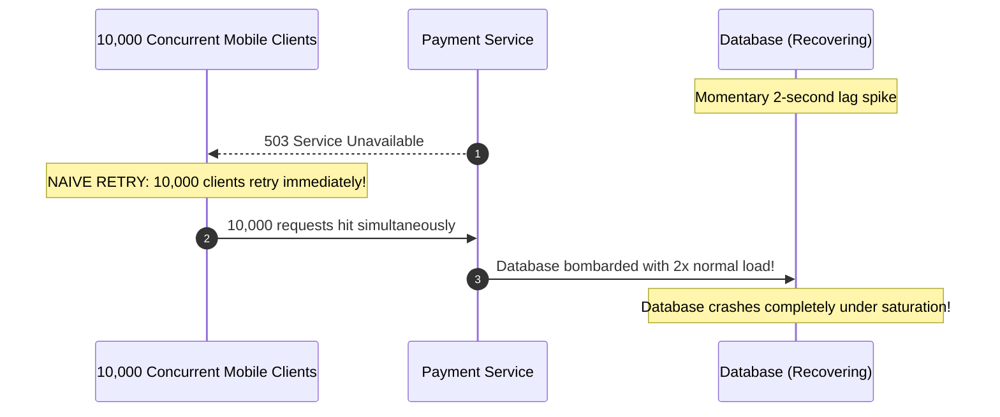
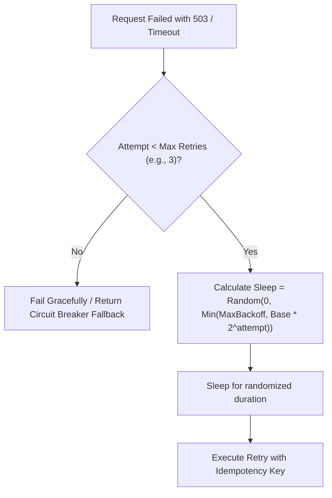

# Retries, Backoff & The Retry Storm

> **Domain**: `00-foundations/distributed-systems`  
> **Status**: Approved  
> **Target Audience**: Solution Architects, Distributed Systems Engineers, SREs

---

## 1. Simple Explanation

When an API call or database query encounters a transient blip (e.g., a momentary network drop or brief CPU spike), **retrying** the request a few moments later often results in success. However, if multiple clients retry simultaneously without coordination, they can create a **Retry Storm** that crashes the downstream service completely.

---

## 2. Architect-Level Deep Dive: The Retry Storm (Thundering Herd)

What happens when a downstream payment database experiences a brief 2-second hiccup?



---

## 3. The Mathematics of Exponential Backoff with Full Jitter

To prevent retry storms, retries must combine **Exponential Backoff** with **Full Randomized Jitter** (AWS Architecture Research):

```text
┌─────────────────────────────────────────────────────────────┐
│                 BACKOFF ALGORITHMS COMPARISON               │
├───────────────────────┬─────────────────────────────────────┤
│ Fixed Interval Retry  │ Wait 1s, Wait 1s, Wait 1s           │
│                       │ (Creates periodic synchronization!) │
├───────────────────────┼─────────────────────────────────────┤
│ Exponential Backoff   │ Wait 2^attempt: 1s, 2s, 4s, 8s      │
│ (Without Jitter)      │ (All clients backoff together, but  │
│                       │ still hit in synchronized waves!)   │
├───────────────────────┼─────────────────────────────────────┤
│ Full Jitter (Optimal) │ Sleep = Random(0, Min(Cap, Base*2^a)│
│                       │ Spreads retries smoothly over time! │
└───────────────────────┴─────────────────────────────────────┘
```



---

## 4. The Concept of Retry Budgets

Even with jitter, if a downstream dependency is completely dead (e.g., an optical fiber cable was severed), retrying every request multiplies traffic volume by $3\times$ or $4\times$, prolonging the outage.

### Production Solution: Retry Budgets (Finagle / gRPC Pattern)
A service client maintains a sliding-window counter:
* **Retry Budget Rule**: Only allow retries if the total percentage of retries across the service is **under 10% of total outbound requests**.
* If retries exceed 10%, the client **drops retries entirely** and immediately returns the error to the caller, preventing cascading network saturation.

---

## 5. Architectural Golden Rules for Retries

1. **Only Retry Transient, Retryable Status Codes**: Retry on `429 Too Many Requests`, `503 Service Unavailable`, `504 Gateway Timeout`. **Never retry** `400 Bad Request`, `401 Unauthorized`, `403 Forbidden`, `404 Not Found`, or `422 Unprocessable Entity`.
2. **Cap Maximum Retry Attempts**: Maximum 3 to 4 attempts. Never retry indefinitely.
3. **Always Combine Retries with Idempotency**: Retrying a non-idempotent `POST` without an `Idempotency-Key` leads to duplicate financial debits!
