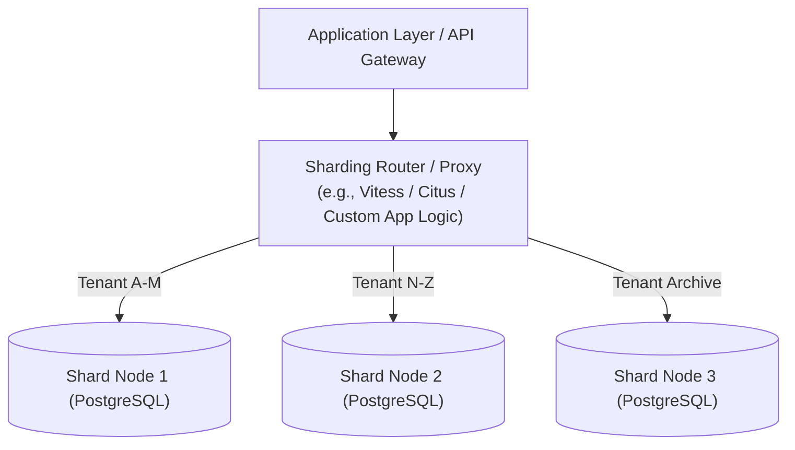

# Database Sharding Topologies & Re-sharding

> **Domain**: `00-foundations/distributed-systems`  
> **Status**: Approved  
> **Target Audience**: Solution Architects, Principal Data Architects

---

## 1. Simple Explanation

While **partitioning** often refers to splitting tables within a single database server, **Sharding** is the physical horizontal partitioning of a database across multiple independent, physically isolated server nodes that share neither RAM nor disk.

---

## 2. Architect-Level Deep Dive: Sharding Architectures



### 2.1 Sharding Topologies
1. **Application-Managed Sharding**: The application code maintains connection pools to all database instances and selects the target shard based on code logic:
   ```csharp
   var shardId = HashFunction.Compute(tenantId) % totalShards;
   using var connection = ShardConnectionFactory.Get(shardId);
   ```
   *Advantage*: Zero proxy latency overhead.  
   *Disadvantage*: High code coupling; re-sharding requires application restarts.
2. **Proxy-Managed Sharding**: A transparent middleware proxy (e.g., Vitess for MySQL, Citus for PostgreSQL, or Envoy) intercepts standard SQL queries, inspects the sharding key, and routes queries to the underlying physical shard.
   *Advantage*: Application remains completely unaware of sharding topology.

---

## 3. The Cross-Shard Penalty (The Distributed Join Problem)

Sharding is easy until queries span multiple shards.

| Operation | Single Shard Query | Cross-Shard Query |
| :--- | :--- | :--- |
| **Lookup by Shard Key** | `SELECT * FROM orders WHERE tenant_id = 'T1'` (Direct route to Shard 1: **1.2ms**) | N/A |
| **Global Aggregation** | N/A | `SELECT SUM(total) FROM orders` (**Scatter-Gather**: Query sent to 50 shards, network latency of slowest node, memory merge in router: **450ms**) |
| **Cross-Shard Join** | Fast local index join inside single database engine | **Distributed Hash Join**: Router must fetch thousands of rows over the network from Shard 1 and Shard 2 to join in application RAM. |
| **Distributed Transactions** | Local ACID transaction (fast WAL write) | **Two-Phase Commit (2PC)**: Distributed locks across shards. Latency skyrockets by 10x-50x. |

---

## 4. Selecting the Shard Key: The Most Irreversible Decision

Choosing the wrong Sharding Key is a catastrophic Type 1 architectural error.

### Evaluation Criteria for Shard Keys
1. **High Cardinality**: The key must have millions of distinct values (e.g., `user_id` or `tenant_id`). Never shard by an enum (`status`, `gender`).
2. **Query Alignment**: The shard key should be present in 95%+ of all OLTP queries to avoid scatter-gather routing.
3. **Write Uniformity**: Avoid keys that create sequential hot spots (e.g., auto-incrementing timestamps).

---

## 5. The Re-sharding Nightmare & Consistent Hashing

What happens when your 4 shards fill up and you must scale out to 8 shards?
* Using basic modulo hashing ($\text{Hash}(\text{Key}) \pmod 4$), changing $N$ from 4 to 8 **invalidates 75% of all keys**, forcing a massive, dangerous multi-terabyte data migration that risks production downtime.
* **Mitigation: Consistent Hashing Ring with Virtual Nodes**:
  * Nodes and keys are mapped to a 360-degree integer ring ($0$ to $2^{32} - 1$).
  * Adding a new shard node only requires migrating a fraction ($\frac{1}{N+1}$) of keys from its immediate neighbor.
