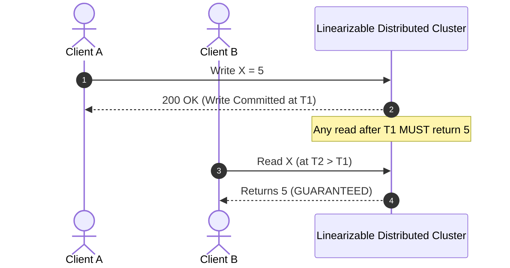
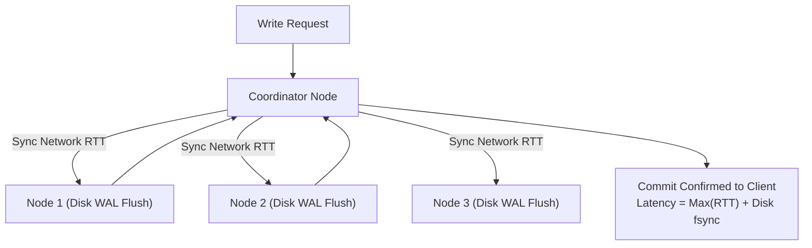

# Strong Consistency & Linearizability

> **Domain**: `00-foundations/distributed-systems`  
> **Status**: Approved  
> **Target Audience**: Solution Architects, Distributed Systems Engineers

---

## 1. Simple Explanation

**Strong Consistency** (specifically Linearizability) gives the illusion that there is only one single copy of the data in the entire universe, and all read and write operations execute instantaneously at a specific point in time, even though the data is physically distributed across dozens of clustered servers.

---

## 2. Architect-Level Deep Dive: Linearizability Defined

A system is **Linearizable** if:
1. Every read operation returns the value of the most recent write operation that completed before the read began.
2. Once a read returns a new value, all subsequent reads (by any client) must return that value or an even newer one.

---

## 3. The Physical Price of Strong Consistency

Strong consistency cannot be achieved for free. It is constrained by the speed of light and network packet round-trips:

### The Three Costs of Linearizability
1. **High Write Latency**: Every write must wait for network round-trips to reach a consensus quorum across physical data centers before returning success to the client.
2. **Reduced Write Availability**: If a network partition isolates more than $\lfloor N/2 \rfloor$ nodes (loss of quorum), the system **strictly halts writes** to prevent split-brain inconsistencies (CP system under CAP).
3. **Throughput Bottlenecks**: State machines must apply updates sequentially or utilize fine-grained pessimistic row locking.

---

## 4. Real-World Implementations

* **Google Spanner**: Achieves external consistency (strict serializability) globally using GPS receivers and atomic clocks in data centers (**TrueTime API**) to provide bounded clock uncertainty intervals ($\epsilon \le 7\text{ms}$).
* **CockroachDB**: Implements Multi-Raft consensus per range and Hybrid Logical Clocks (HLC) combining physical time with Lamport logical counters.
* **Apache ZooKeeper / etcd**: Leverages Zab / Raft consensus algorithms to maintain a strictly linearizable key-value store for cluster metadata and leader election.

---

## 5. Decision Rubric: When is Strong Consistency Mandatory?

* **Financial Ledgers**: Debiting account balance $A$ and crediting account balance $B$. A double-spend bug is a direct financial loss.
* **Distributed Leader Election**: Guaranteeing that exactly **one** primary master node is active to prevent catastrophic split-brain cluster corruption.
* **Inventory Allocation (Low Stock / High Value)**: Selling the last 3 airline tickets or concert seats.
