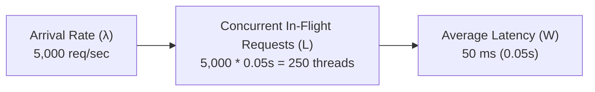
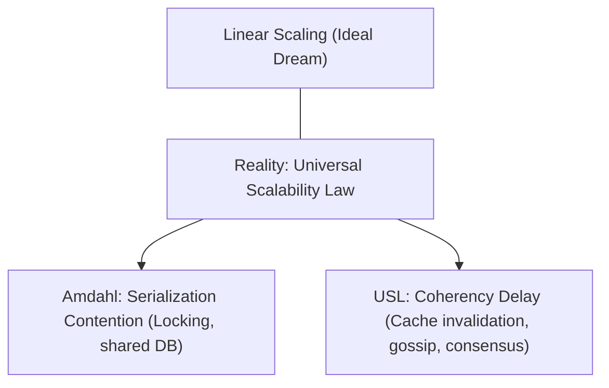

# Throughput & Scalability Laws (Little's Law & USL)

> **Domain**: `00-foundations/distributed-systems`  
> **Status**: Approved  
> **Target Audience**: Solution Architects, Performance Engineers

---

## 1. Simple Explanation

**Throughput** is the rate at which a system processes work, measured in units like Requests Per Second (RPS), Transactions Per Second (TPS), or Megabits Per Second (Mbps). Increasing throughput is not just about adding faster hardware; it is governed by mathematical laws of concurrency and resource contention.

---

## 2. Architect-Level Deep Dive: The Mathematical Laws

### 2.1 Little's Law
In any stable queuing system, the average number of concurrent requests in the system ($L$) equals the arrival rate/throughput ($\lambda$) multiplied by the average latency ($W$):
$$L = \lambda \times W$$

#### Production Application
If your service receives $\lambda = 10,000\text{ RPS}$ and average latency $W = 200\text{ms} (0.2\text{s})$, your infrastructure must maintain:
$$L = 10,000 \times 0.2 = 2,000 \text{ concurrent connections / worker threads}$$
If your thread pool or database connection pool is capped at 500, requests will queue up, latency ($W$) will skyrocket, and the system will crash.

---

### 2.2 Amdahl’s Law vs. The Universal Scalability Law (USL)

Why doesn't adding twice as many CPU cores or servers double throughput?

#### 1. Amdahl's Law (Serialization Contention)
If a fraction $\alpha$ of your software must execute serially (e.g., acquiring a database row lock or writing to a shared log), maximum speedup with $N$ processors is bounded by:
$$\text{Speedup}(N) = \frac{1}{\alpha + \frac{1 - \alpha}{N}}$$
Even with infinite processors, if 5% of your code is serial ($\alpha = 0.05$), the maximum possible speedup is $20\times$.

#### 2. Gunther’s Universal Scalability Law (USL)
Amdahl's law assumes adding workers never slows things down. Dr. Neil Gunther added the **coherency penalty** ($\beta$)—the cross-talk required for nodes to agree on state (cache invalidation, replication gossip):
$$C(N) = \frac{N}{1 + \alpha(N - 1) + \beta N(N - 1)}$$
* Because coherency overhead grows quadratically ($\beta N^2$), **adding more nodes eventually causes throughput to decline** (retrograde scalability).

---

## 3. Production Guidelines for Maximizing Throughput

1. **Eliminate Shared Global Locks**: Partition data so nodes work independently without lock contention ($\alpha \to 0$).
2. **Minimize Inter-Node Coherency Chat**: Avoid multi-master replication with heavy consensus gossip ($\beta \to 0$).
3. **Embrace Share-Nothing Architecture**: Independent worker processes sharing state only via partitioned append logs (Kafka) or partitioned databases.
