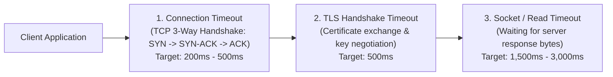
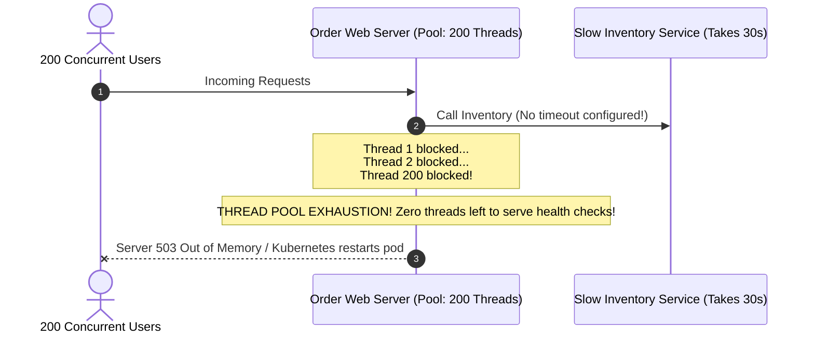
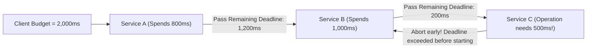

# Timeouts & Cascading Failure Prevention

> **Domain**: `00-foundations/distributed-systems`  
> **Status**: Approved  
> **Target Audience**: Solution Architects, Principal Engineers, SREs

---

## 1. Simple Explanation

A **Timeout** is a non-negotiable deadline: if a remote network call or database query does not return an answer within a specified period of time, the client abruptly terminates the waiting connection and takes corrective action.

In software architecture, **a slow downstream dependency is far more dangerous than a dead one.** A dead service fails fast in 1 millisecond; a slow service holds server worker threads hostage for minutes, triggering cascading total system collapse.

---

## 2. Architect-Level Deep Dive: Anatomy of a Network Timeout

A single HTTP call traverses multiple distinct network layers, each requiring an explicit timeout setting:

### The Anatomy of the Three Timeouts
1. **Connection Timeout**: Time allowed to establish the underlying TCP socket. If the remote host is offline or a firewall silently drops packets, default OS kernel timeouts can wait **75 seconds**! (Must be capped at `500ms`).
2. **TLS Handshake Timeout**: Time allowed to negotiate encryption keys and validate certificates. (Must be capped at `1,000ms`).
3. **Socket / Read Timeout**: Time allowed between reading incoming data bytes from the socket. This governs how long the application waits for the server to process the query and send data.

---

## 3. The Thread Pool Starvation Disaster

What happens when an architect leaves timeouts at default values?

---

## 4. Deadline Propagation (The Context Deadline Pattern)

In modern microservices with deep call chains ($A \to B \to C \to D$), individual static timeouts are insufficient:

### The Deadline Propagation Principle (gRPC / Go Context / W3C Baggage)
* Service A receives a request with a total latency budget of `2,000ms`.
* Service A spends `800ms` doing local work.
* When Service A calls Service B, it passes the **Remaining Deadline (`1,200ms`)** in the RPC metadata.
* When Service B calls Service C, only `200ms` remain.
* Service C knows its database query takes at least `500ms`. Instead of wasting database CPU on work that will arrive too late for the user anyway, **Service C rejects the call immediately**, saving enterprise compute resources!
