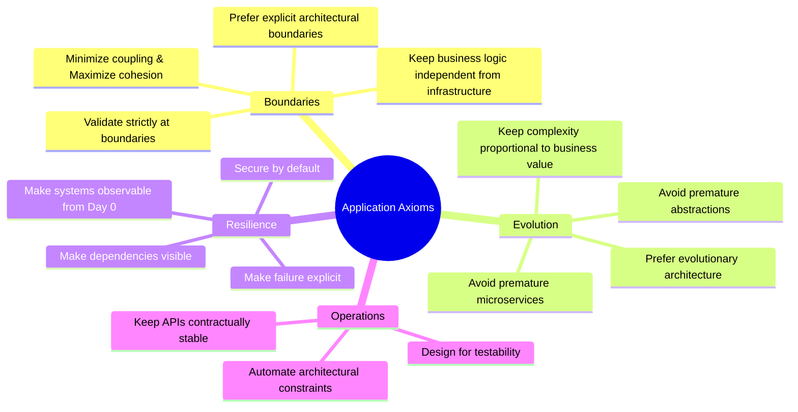

# Application Engineering Principles

## 1. Executive Philosophy

Application architecture is the structural bridge connecting abstract enterprise strategy with executable code. While system design governs how nodes coordinate across networks, application engineering governs how classes, modules, packages, and components interact within a deployable unit.

The primary objective of application architecture is **managing complexity and change**: ensuring that as domain rules expand and teams scale, software remains understandable, testable, maintainable, secure, and resilient.

---

## 2. The 17 Core Application Engineering Axioms

### 1. Keep Business Logic Independent from Infrastructure
The domain core represents pure business policy. It must never depend on database drivers, ORMs, cloud SDKs, web frameworks, or third-party transports. Infrastructure is an exchangeable implementation detail.

### 2. Prefer Explicit Boundaries Over Implicit Convenience
Cross-boundary calls must pass through typed interfaces, DTOs, or domain events. Implicit coupling (e.g., passing active database entities into UI controllers or background workers) destroys maintainability.

### 3. Minimize Coupling Across Components
Components should possess minimal knowledge of their collaborators' internal mechanics. Coupling must be loose, directional, and mediated through abstractions.

### 4. Maximize Cohesion Within Components
Elements that change together for the same business reason must reside together within the same module or package.

### 5. Prefer Composition Over Unnecessary Inheritance
Deep class inheritance hierarchies create rigid coupling, fragile base classes, and polymorphic confusion. Compose behaviors via interfaces and dependency injection.

### 6. Keep Public APIs Contractually Stable
Never break consumers without explicit versioning, deprecation windows, and backward-compatible serialization policies.

### 7. Make Failure Explicit
Do not swallow exceptions or return ambiguous `null` values. Model failure through explicit Result objects, domain errors, or structured Problem Details (RFC 7807).

### 8. Make Dependencies Visible
Never hide dependencies inside service locators, static global singletons, or ambient thread context. Inject collaborators explicitly via constructors.

### 9. Make Systems Observable from Day 0
Structured logging, correlation IDs, OpenTelemetry metrics, and error telemetry must be baked into the application structure, not bolted on after an outage.

### 10. Design for Deterministic Testability
Decouple compute logic from wall-clock time, randomized UUIDs, and external networks so unit and integration tests run fast, deterministically, and without flakes.

### 11. Secure by Default
Deny access by default. Apply zero trust, principle of least privilege, input sanitization, and cryptographic identity tokens at all ingress boundaries.

### 12. Validate Strictly at Boundaries
External data is inherently untrusted. Validate payloads at the API Gateway and application perimeter; keep inner domain models pure and perpetually valid.

### 13. Avoid Premature Abstraction
Do not invent generic multi-layered frameworks for hypothetical future requirements. Three concrete use cases justify an abstraction; one does not.

### 14. Avoid Premature Microservices
Start with a well-structured Modular Monolith. The cost of distributed transactions, network latency, and operational overhead exceeds monolithic complexity for small teams.

### 15. Prefer Evolutionary Architecture
Structure software so that technical components (storage engines, UI frameworks, cloud providers) can be swapped incrementally via fitness functions without rewrites.

### 16. Automate Architectural Constraints
Do not rely on human memory in code reviews. Enforce package boundaries, dependency rules, and layer constraints using automated architecture tests (ArchUnit, NetArchTest).

### 17. Keep Complexity Proportional to Business Value
Simple CRUD domains require simple layered architectures. Reserve full Domain-Driven Design, Event Sourcing, and CQRS for high-complexity core business domains.
