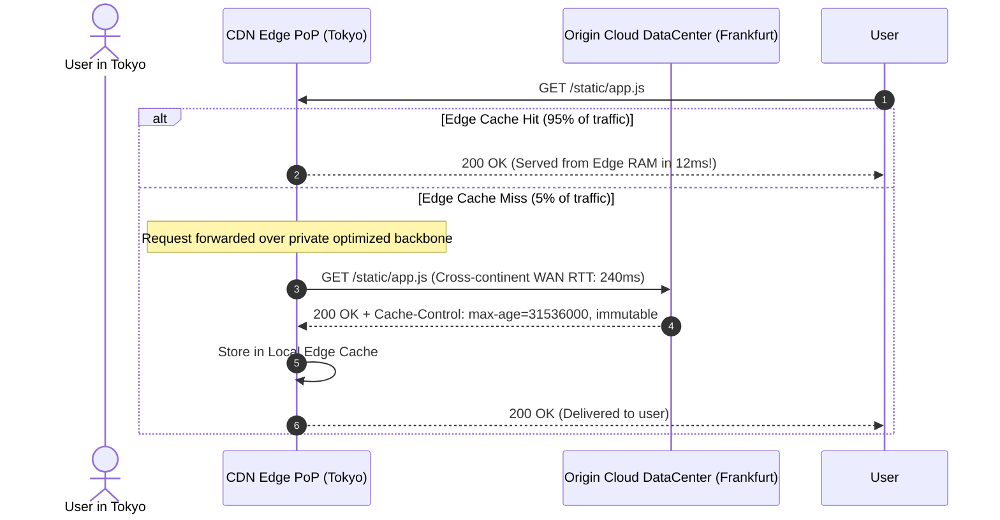

# Content Delivery Networks (CDN) & Edge Caching

> **Domain**: `00-foundations/networking`  
> **Status**: Approved  
> **Target Audience**: Solution Architects, Frontend Architects, Performance Engineers

---

## 1. Simple Explanation

A **Content Delivery Network (CDN)** is a globally distributed network of edge proxy servers (Points of Presence - PoPs) positioned geographically close to end users. By caching static files (images, CSS, JavaScript) and cacheable API responses at the edge, CDNs drastically reduce network latency and protect origin servers from traffic saturation.

---

## 2. Architect-Level Deep Dive: Edge Mechanics



---

## 3. Dynamic Site Acceleration (DSA)

CDNs do not only accelerate static files. For uncacheable, dynamic API traffic (e.g., `POST /api/v1/checkout`):
1. **Edge TCP & TLS Termination**: The mobile client completes the TCP 3-way handshake and TLS 1.3 negotiation with the local CDN PoP (e.g., in Tokyo, 10ms RTT) instead of the distant origin in Frankfurt.
2. **Persistent Optimized Connection Pools**: The CDN maintains pre-warmed, persistent TCP/QUIC connections across its private global fiber backbone to the origin.
3. **Route Optimization**: Real-time telemetry allows the CDN to route around internet congestion and BGP packet drops, reducing dynamic API latency by **20% to 40%**.

---

## 4. Cache Invalidation & Cache-Control Headers

The two hardest problems in computer science are naming things and **cache invalidation**.

### 4.1 The Modern Solution: Cache-Busting via Content Hashing
* Never deploy static assets with generic names (`app.js`, `style.css`).
* Webpack, Vite, and modern build tools append cryptographic content hashes to filenames: `app.7b9c2a.js`.
* Set origin headers:
  ```http
  Cache-Control: public, max-age=31536000, immutable
  ```
  This instructs the CDN and browser to cache the file for **one full year** without revalidating. When code changes, the filename changes, completely bypassing the need for manual cache purging!

### 4.2 API Caching: Stale-While-Revalidate
For semi-dynamic APIs (e.g., product catalog or exchange rates):
```http
Cache-Control: max-age=60, stale-while-revalidate=300
```
* Serves cached response immediately for 60 seconds.
* Between seconds 60 and 360, it serves the stale cached response instantly to the user while asynchronously fetching fresh data from origin in the background.

---

## 5. Origin Shielding Pattern

When 200 CDN edge PoPs experience a cache miss for the same resource simultaneously, they can launch an accidental DDoS attack against your origin server (**Thundering Herd**).

* **Origin Shielding**: Designates a central, high-capacity intermediate CDN cache layer (e.g., in the same AWS region as your origin).
* All regional PoP misses route through the Origin Shield; the shield consolidates duplicate requests, ensuring the origin server receives only a single request.
