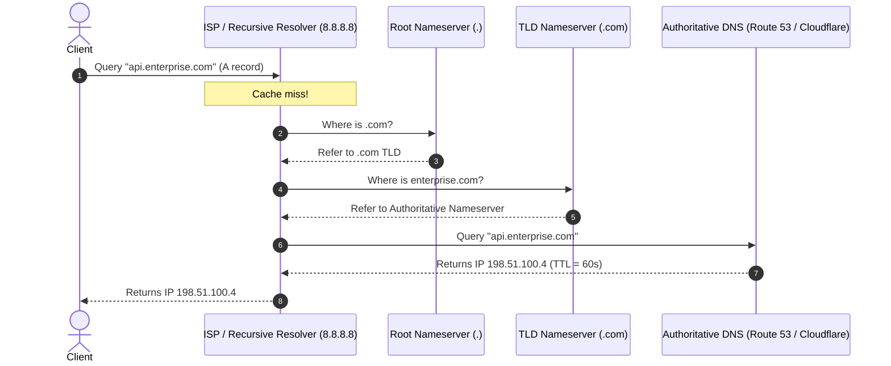
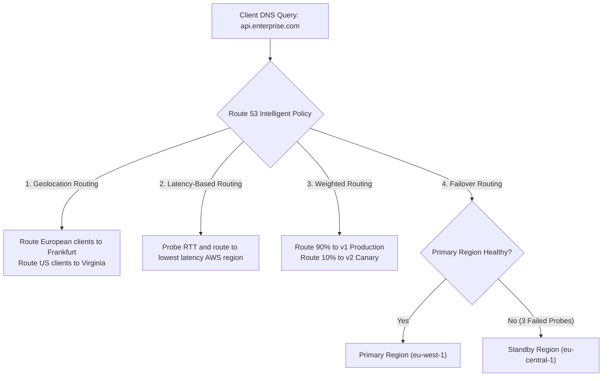

# DNS Architecture & Global Traffic Management

> **Domain**: `00-foundations/networking`  
> **Status**: Approved  
> **Target Audience**: Solution Architects, Cloud Architects, SREs

---

## 1. Simple Explanation

The **Domain Name System (DNS)** is the phonebook of the internet, translating human-readable hostnames (`api.enterprise.com`) into computer-routable IP addresses (`192.0.2.1` or `2001:db8::1`). In modern enterprise architecture, DNS is not just a lookup table; it is a critical **Global Traffic Steering and Disaster Recovery Failover engine**.

---

## 2. DNS Resolution Flow & Latency Impact



---

## 3. The Time-to-Live (TTL) Dilemma

Every DNS record has a **TTL (Time to Live)** value in seconds that instructs recursive resolvers how long to cache the IP address before asking again.

```text
┌─────────────────────────────────────────────────────────────┐
│                     THE DNS TTL TRADE-OFF                   │
├───────────────────────────────┬─────────────────────────────┤
│ HIGH TTL (e.g., 86,400s / 1 Day)│ LOW TTL (e.g., 60s / 1 Min) │
├───────────────────────────────┼─────────────────────────────┤
│ Advantages:                   │ Advantages:                 │
│ - Ultra-fast resolution (cache│ - Fast disaster failover.   │
│   hits at ISP/client).        │ - Rapid traffic migration   │
│ - Low DNS query bill.         │   during cloud cutovers.    │
│ Disadvantages:                │ Disadvantages:              │
│ - DR failover takes 24 hours! │ - Higher resolution latency │
│   Traffic remains trapped on  │   on cache misses.          │
│   dead IP address.            │ - Higher DNS provider cost. │
└───────────────────────────────┴─────────────────────────────┘
```

### Architectural Best Practice: The Pre-Migration TTL Lowering
* Standard production state: `TTL = 300 seconds (5 minutes)`.
* 48 hours prior to a major data center or cloud migration: Lower `TTL to 60 seconds`.
* Complete migration and verify traffic health.
* Return `TTL to 300 seconds`.

---

## 4. Advanced Routing Policies for Disaster Recovery

Modern cloud DNS providers (AWS Route 53, Cloudflare, Azure DNS) offer intelligent routing policies:



---

## 5. The Anycast BGP Alternative to DNS Failover

DNS failover has one major operational flaw: **Client DNS Caching**. Rogue ISPs, corporate proxies, and mobile operating systems often ignore DNS TTL and cache records for hours, preventing users from receiving the new failover IP.

### The Architectural Upgrade: Anycast IP Routing
Instead of updating DNS records during an outage, assign the application an **Anycast IP address** (via AWS Global Accelerator or Cloudflare):
* The same public IP (`198.51.100.1`) is advertised simultaneously from 200+ edge data centers worldwide via BGP (Border Gateway Protocol).
* If a region dies, the Anycast network automatically reroutes network packets over the provider's private fiber backbone to a healthy region in **seconds**, completely bypassing client-side DNS caching!
