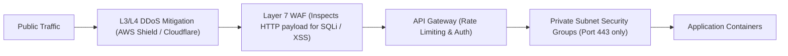

# Firewalls, WAFs & DDoS Defense

> **Domain**: `00-foundations/networking`  
> **Status**: Approved  
> **Target Audience**: Solution Architects, Security Architects, Cloud Engineers

---

## 1. Simple Explanation

A **Firewall** is a network security barrier that monitors and filters incoming and outgoing network traffic based on predetermined security rules. In modern enterprise architecture, defenses are multi-tiered:
* **Network Firewalls (L3/L4)** inspect IP addresses and TCP/UDP ports.
* **Web Application Firewalls (WAF - L7)** inspect the actual HTTP payload, protecting applications from web exploits like SQL injection, cross-site scripting (XSS), and malicious bots.

---

## 2. Layer 3/4 Network Firewalls vs. Layer 7 WAFs

```text
┌─────────────────────────────────────────────────────────────┐
│                 NETWORK FIREWALL VS. WAF                    │
├───────────────────┬─────────────────────────────────────────┤
│ L3/L4 NETWORK FW  │ L7 WEB APPLICATION FIREWALL (WAF)       │
├───────────────────┼─────────────────────────────────────────┤
│ AWS Security Grps,│ Cloudflare WAF, AWS WAF, Imperva.       │
│ iptables, pfSense │                                         │
│ Inspects: IP, Port│ Inspects: HTTP Headers, Body, URI, JSON │
│ Protects against: │ Protects against: OWASP Top 10 (SQLi,   │
│ Port scans, SYN   │ XSS, Log4j, Command Injection, Bot      │
│ floods, rogue IPs │ scrapers, Credential stuffing).         │
└───────────────────┴─────────────────────────────────────────┘
```



---

## 3. The 3 Types of DDoS Attacks

Architects must engineer defenses against three distinct categories of Distributed Denial of Service (DDoS):

### 1. Volumetric Attacks (Layer 3/4)
* **Mechanics**: Flood network interfaces with massive traffic volumes (e.g., 1 Tbps UDP reflection, NTP amplification) to saturate physical bandwidth.
* **Defense**: Must be mitigated at the edge by hyper-scale cloud providers (Cloudflare, AWS Shield Advanced) possessing multi-terabit capacity; an on-prem data center pipe will saturate immediately.

### 2. Protocol Attacks (Layer 4)
* **Mechanics**: Exploit weaknesses in transport protocols (SYN flood, Ping of Death) to exhaust state tables in routers, firewalls, and load balancers.
* **Defense**: SYN cookies, TCP proxy termination at the edge.

### 3. Application Layer Attacks (Layer 7)
* **Mechanics**: Generate legitimate-looking HTTP requests targeting heavy endpoints (e.g., repeating a complex SQL search query 10,000 times a second).
* **Defense**: WAF rate limiting rules (e.g., block client if `POST /api/search` exceeds 100 requests in 1 minute); challenge-response (CAPTCHA / Cloudflare Turnstile); IP reputation feeds.

---

## 4. Architectural Rules for Cloud Firewalls

1. **Deny All Inbound by Default**: Zero open ports unless explicitly whitelisted.
2. **Strictly Prohibit Public SSH / RDP**: Ports `22` and `3389` must never be open to `0.0.0.0/0`. Access must be routed through AWS SSM Session Manager, Teleport, or a Zero Trust VPN.
3. **Defense in Depth**: WAF at the edge, Security Groups on the load balancer, Network Policies inside Kubernetes, and mTLS between pods.
