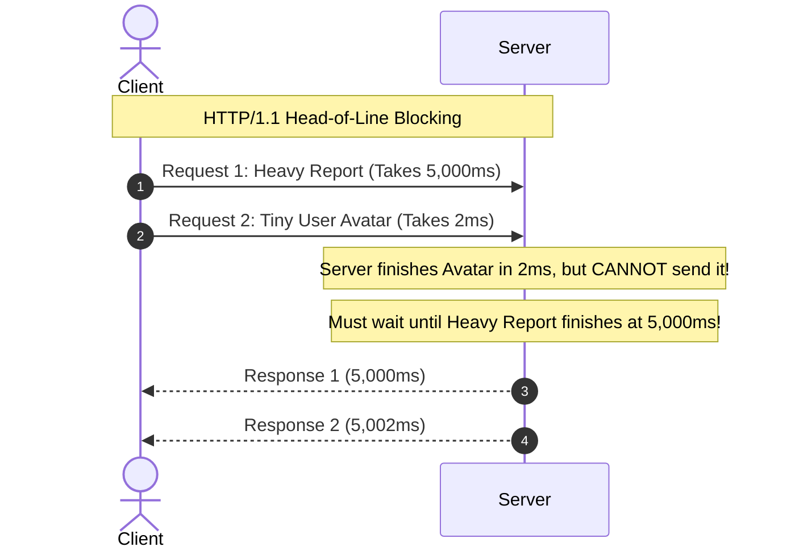

# HTTP/1.1: Semantics, Connections & Limitations

> **Domain**: `00-foundations/networking`  
> **Status**: Approved  
> **Target Audience**: Solution Architects, API Designers, Backend Engineers

---

## 1. Simple Explanation

**HTTP (Hypertext Transfer Protocol)** is the foundational request-response application protocol that powers the World Wide Web and RESTful enterprise microservices. HTTP/1.1 (standardized in RFC 2616 / RFC 7230) introduced persistent TCP connections, chunked transfer encoding, and virtual hosting, but suffers from fundamental performance bottlenecks that modern architectures must navigate.

---

## 2. Core Protocol Semantics

```text
┌─────────────────────────────────────────────────────────────┐
│                 HTTP/1.1 MESSAGE ANATOMY                    │
├─────────────────────────────────────────────────────────────┤
│ METHOD /path/resource HTTP/1.1  <- Request Line             │
│ Host: api.enterprise.com        <- Mandatory Header         │
│ Authorization: Bearer eyJhbG... <- Auth Header              │
│ Content-Type: application/json  <- MIME Type                │
│ Content-Length: 42              <- Body Size in Bytes       │
│                                 <- Empty Line               │
│ {"orderId": "1001", "amount": 99.00} <- Payload Body       │
└─────────────────────────────────────────────────────────────┘
```

### 2.1 The Idempotent & Safe Verbs
* **Safe Methods**: Calling them produces zero state mutations on the server (`GET`, `HEAD`, `OPTIONS`).
* **Idempotent Methods**: Executing the call multiple times produces the identical server state as executing it once (`GET`, `PUT`, `DELETE`).
* **Non-Idempotent Methods**: Appends state or triggers side-effects (`POST`, `PATCH`).

---

## 3. The Keep-Alive Breakthrough vs. HTTP Pipelining

### 3.1 HTTP/1.0 (The Connection Per Request Waste)
In HTTP/1.0, every single HTTP request opened a new TCP connection, executed the 3-way handshake, exchanged data, and closed the connection. For a webpage loading 50 images, this incurred **50 consecutive TCP handshakes**!

### 3.2 HTTP/1.1 Keep-Alive (Persistent Connections)
HTTP/1.1 introduced `Connection: keep-alive` by default:
* Sockets remain open after a response, allowing subsequent HTTP requests to reuse the established TCP connection, eliminating TCP handshake overhead.

### 3.3 The Failure of HTTP Pipelining
HTTP/1.1 attempted to support sending multiple requests without waiting for each response (pipelining). However, because responses **had to be returned in the exact order requested**, a slow first request blocked all subsequent responses—creating **HTTP Head-of-Line Blocking**. Virtually all browsers and servers disabled pipelining due to buggy proxy implementations.



---

## 4. Architectural Workarounds in the HTTP/1.1 Era

Because browsers enforce a hard limit of **6 concurrent TCP connections per domain** in HTTP/1.1:
1. **Domain Sharding**: Web apps split assets across multiple subdomains (`img1.domain.com`, `img2.domain.com`) to trick browsers into opening 24 connections.
2. **File Bundling & Image Spriting**: Combining hundreds of CSS/JS files or icons into a single massive file to reduce HTTP request count.

*In HTTP/2 and HTTP/3, these workarounds become active anti-patterns!*
