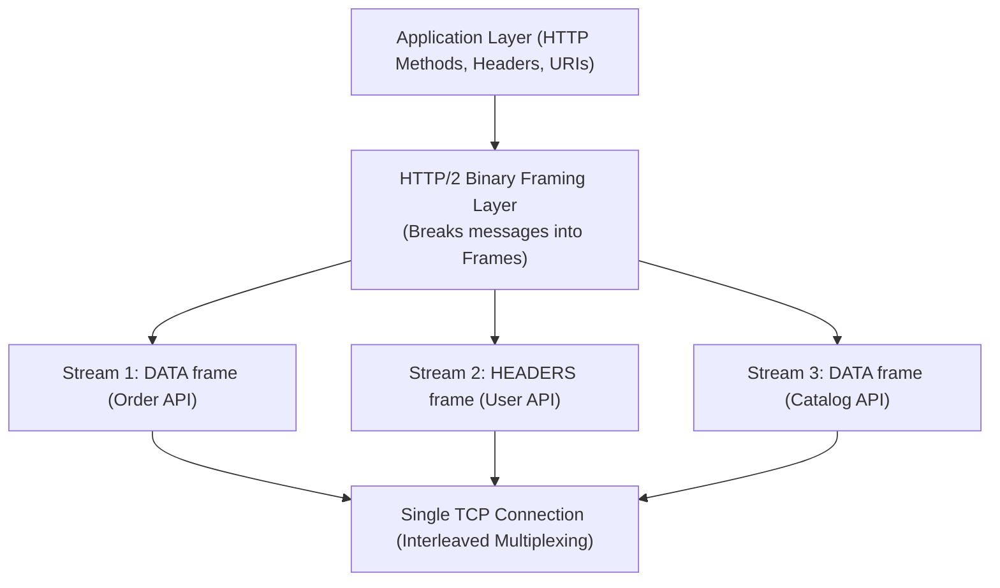

# HTTP/2: Binary Framing, Multiplexing & HPACK

> **Domain**: `00-foundations/networking`  
> **Status**: Approved  
> **Target Audience**: Solution Architects, Web Architects, Performance Engineers

---

## 1. Simple Explanation

**HTTP/2** (standardized in RFC 7540, derived from Google SPDY) fundamentally overhauled how HTTP messages are formatted and transmitted across the network, replacing textual plain-text protocols with an optimized **binary framing layer** that allows hundreds of concurrent requests to travel over a single TCP connection simultaneously.

---

## 2. Core Architectural Breakthroughs

### 2.1 The Binary Framing Layer
Unlike HTTP/1.1 which parses newlines (`\r\n`) and plain ASCII text, HTTP/2 breaks every message into small, typed binary **Frames** (e.g., `HEADERS` frame, `DATA` frame, `RST_STREAM` frame, `SETTINGS` frame).

### 2.2 True Multiplexing (No More HTTP Head-of-Line Blocking)
* Multiple bidirectional **Streams** share a single TCP connection.
* Each stream has an integer identifier (Streams initiated by clients have odd IDs; streams initiated by servers have even IDs).
* Frames from different streams are interleaved across the wire and reassembled by the receiving peer.
* A slow or heavy 10MB report on Stream 1 **does not block** a fast 2KB avatar on Stream 3!

### 2.3 HPACK Header Compression
In HTTP/1.1, every request repeats the same redundant HTTP headers (User-Agent, Authorization Bearer token, Cookie), wasting 1KB to 2KB per request.
* **HPACK (RFC 7541)** introduces:
  1. A static table of 61 common pre-defined headers.
  2. A dynamic table where client and server remember headers sent previously on that connection. If the client sends the same auth token twice, it transmits only a 1-byte index reference!
  3. Huffman coding for strings.
* **Result**: Reduces HTTP header overhead by **85% to 90%**.

---

## 3. Server Push: The Failed Promise

HTTP/2 introduced **Server Push**—allowing a server to preemptively send resources (e.g., `app.js`, `style.css`) to the client before the client parses the HTML and requests them.

### Why Server Push Failed in Enterprise Production
* **Cache Waste**: The server pushed resources that the browser already had cached locally, wasting mobile data plans.
* **CPU Contention**: Server pushed resources contested with the primary HTML stream.
* **Outcome**: Chrome and major CDNs deprecated Server Push; the industry standardized instead on the `103 Early Hints` status code.

---

## 4. The Achilles' Heel of HTTP/2: TCP Head-of-Line Blocking

While HTTP/2 completely eliminated *application-level* head-of-line blocking, it exacerbated **transport-level TCP Head-of-Line Blocking**:
* All 100 concurrent HTTP/2 streams travel over **one single TCP connection**.
* If a single TCP packet is dropped on a lossy cellular network (e.g., 2% packet loss on 4G/5G), the OS kernel stops delivering data for **all 100 multiplexed streams** until TCP retransmits the lost packet.
* Under packet loss conditions, HTTP/1.1 (with 6 independent TCP connections) often outperformed HTTP/2! This directly led to the development of **HTTP/3 over QUIC**.
