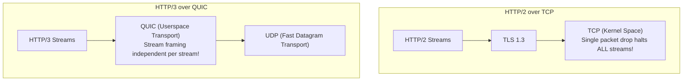

# HTTP/3 & QUIC: Eliminating Head-of-Line Blocking

> **Domain**: `00-foundations/networking`  
> **Status**: Approved  
> **Target Audience**: Solution Architects, Mobile Architects, Network Engineers

---

## 1. Simple Explanation

**HTTP/3** (standardized in RFC 9114 in 2022) is the latest iteration of the HTTP standard. Instead of running on top of traditional TCP, HTTP/3 replaces TCP entirely with **QUIC**, a modern transport protocol built directly on top of **UDP (User Datagram Protocol)**.

By moving transport logic into userspace and bundling TLS 1.3 encryption natively into the connection, HTTP/3 eliminates TCP Head-of-Line blocking and enables zero-roundtrip (0-RTT) handshakes and seamless mobile IP connection migration.

---

## 2. The Protocol Stack Evolution

```text
┌─────────────────────────────────────────────────────────────┐
│                 HTTP PROTOCOL STACK EVOLUTION               │
├───────────────────────────────┬─────────────────────────────┤
│ HTTP/1.1 & HTTP/2             │ HTTP/3                      │
├───────────────────────────────┼─────────────────────────────┤
│ HTTP/1.1 or HTTP/2            │ HTTP/3                      │
│ TLS 1.2 or TLS 1.3            │ QUIC (Native TLS 1.3 Crypto)│
│ TCP                           │ UDP                         │
│ IP                            │ IP                          │
└───────────────────────────────┴─────────────────────────────┘
```



---

## 3. Core Architectural Advantages of HTTP/3

### 3.1 Total Elimination of Head-of-Line Blocking
In QUIC, streams are first-class transport citizens:
* If packet #4 belonging to Stream 1 drops, **only Stream 1 pauses**.
* Stream 2, Stream 3, and Stream 4 continue delivering bytes to the application uninterrupted.
* On lossy wireless networks (2%–5% packet loss on mobile), HTTP/3 delivers a **20%–40% latency improvement** over HTTP/2.

### 3.2 0-RTT Connection Resumption (Zero Round-Trip Time)
By embedding TLS 1.3 natively into the QUIC handshake:
* Initial connection: Combined transport + crypto handshake in **1 RTT** (vs. 2–3 RTTs in HTTP/1.1 + TLS).
* Reconnection (e.g., returning mobile user): **0-RTT**! The client encrypts application request bytes using cached cryptographic tokens in the very first UDP packet sent!

### 3.3 Connection Migration (The Wi-Fi to 5G Handover)
* Traditional TCP identifies connections by a 4-tuple: `(Source IP, Source Port, Dest IP, Dest Port)`. When a mobile phone moves out of range of a Wi-Fi router and switches to 5G cellular, its IP address changes. In TCP, the socket is destroyed; active video streams stall; downloads abort; connections must be renegotiated from scratch.
* **QUIC uses a 64-bit Connection ID (CID)** independent of network IP addresses. When the phone switches to 5G, it simply sends its existing CID from the new cellular IP. The video stream continues playing without dropping a single frame!

---

## 4. Production Considerations & Enterprise Readiness

1. **UDP Firewall Blocking**: Some corporate enterprise networks and egress proxies block outbound UDP traffic on port 443 (treating UDP as video streaming or DNS tunneling).
   * *Fallback*: Browsers support graceful fallback: they attempt HTTP/3 via an `Alt-Svc: h3=":443"` header; if UDP is blocked, they immediately fall back to HTTP/2 over TCP.
2. **CPU Overhead**: Because QUIC executes in userspace rather than kernel space, early implementations exhibited higher CPU consumption on servers. Modern hardware crypto acceleration (AES-NI) has largely closed this gap.
