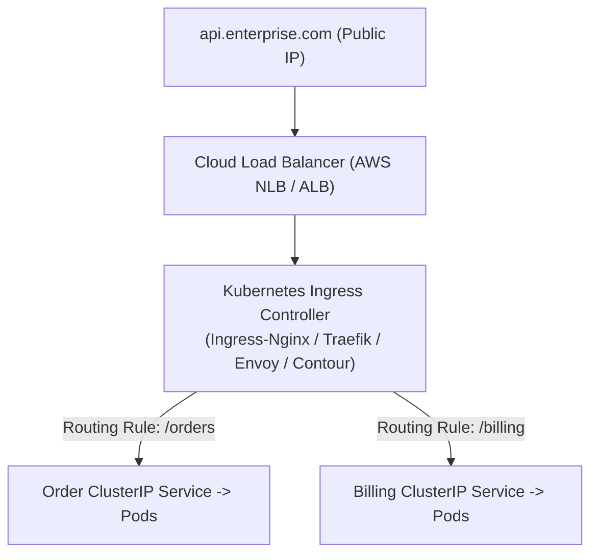

# Ingress, Egress & Cloud Data Transfer Costs

> **Domain**: `00-foundations/networking`  
> **Status**: Approved  
> **Target Audience**: Solution Architects, Cloud Architects, FinOps Practitioners

---

## 1. Simple Explanation

* **Ingress**: Network traffic entering your private cloud network or Kubernetes cluster from the outside world. (Cloud providers almost always make ingress **FREE** to encourage data onboarding).
* **Egress**: Network traffic leaving your cloud network, heading to the public internet, other cloud regions, or external SaaS providers. (Cloud providers charge **heavily** for egress).

---

## 2. The Cloud Egress Cost Trap (FinOps Reality)

A critical responsibility of an Enterprise Architect is designing network topologies that prevent multi-million dollar cloud billing surprises:

```mermaid
flowchart LR
    subgraph IngressTraffic ["Ingress (Inbound Traffic)"]
        User["Client"] -->|100 TB Inbound: $0.00 FREE!| AWS["AWS Cloud (us-east-1)"]
    end

    subgraph EgressTraffic ["Egress (Outbound Traffic)"]
        AWS -->|Internet Egress: $0.09 per GB ($9,000 / 100 TB)| Internet["Public Internet"]
        AWS -->|Cross-Region Egress: $0.02 per GB ($2,000 / 100 TB)| West["AWS Region (us-west-2)"]
        AWS -->|Cross-AZ Egress: $0.01 per GB ($1,000 / 100 TB)| AZ2["Same Region AZ (us-east-1b)"]
        AWS -->|NAT Gateway Processing: $0.045 per GB ($4,500 / 100 TB)| NAT["NAT Gateway"]
    end
```

### The $50,000 NAT Gateway Mistake
Application pods in private subnets communicating with public AWS APIs (e.g., S3, DynamoDB) route traffic through an **AWS NAT Gateway**:
* NAT Gateway charges an hourly fee **PLUS $0.045 per GB of data processed**!
* Streaming 1 Petabyte of analytical data to S3 through a NAT Gateway generates a **$45,000 monthly surprise bill** on top of normal storage fees.

### The Architectural Remedy: VPC Endpoints (AWS PrivateLink)
* Provision a **VPC Gateway Endpoint** (Free for S3 and DynamoDB) or an **Interface Endpoint** (PrivateLink).
* Traffic routes directly across the AWS private hypervisor network without touching NAT Gateways, **slashing egress costs by 90%+ and lowering network latency**.

---

## 3. Ingress Controllers in Kubernetes Architecture

In container orchestration, the **Ingress Controller** acts as the smart Layer 7 reverse proxy managing ingress traffic into Kubernetes pods:



### Key Ingress Responsibilities
1. **Host-Based Routing**: Routing `api.company.com` vs. `admin.company.com` to different pod deployments.
2. **Path-Based Routing**: Routing `/api/v1/checkout` vs. `/api/v1/search`.
3. **Canary Slicing**: Using ingress annotations (e.g., `nginx.ingress.kubernetes.io/canary-weight: "10"`) to split 10% of traffic to experimental canary pods.
