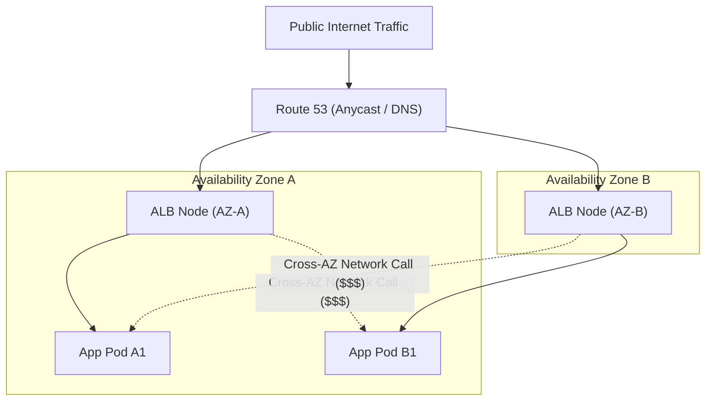

# Load Balancer Topologies & Network Architectures

> **Domain**: `00-foundations/networking`  
> **Status**: Approved  
> **Target Audience**: Solution Architects, Network Architects, Cloud Engineers

---

## 1. Simple Explanation

In networking architecture, a **Load Balancer** serves as the central traffic distribution hub. Beyond simple round-robin scheduling, modern enterprise load balancers manage cross-zone high availability, SSL offloading, network address translation, and zero-downtime traffic cutovers.

---

## 2. Hardware vs. Software vs. Cloud-Managed Load Balancers

```text
┌─────────────────────────────────────────────────────────────┐
│                 LOAD BALANCER DELIVERY MODELS               │
├───────────────────┬─────────────────────────────────────────┤
│ 1. Hardware       │ F5 BIG-IP, Citrix ADC (NetScaler).      │
│    Appliances     │ Extreme performance via dedicated ASICs.│
│                   │ High CapEx; rigid; slow to scale.       │
├───────────────────┼─────────────────────────────────────────┤
│ 2. Software       │ HAProxy, Nginx, Envoy, Keepalived.      │
│    (Self-Hosted)  │ Runs on commodity Linux VMs. Great      │
│                   │ flexibility, but requires OS patching.  │
├───────────────────┼─────────────────────────────────────────┤
│ 3. Cloud-Managed  │ AWS ALB/NLB, Azure App Gateway, GCP LB. │
│                   │ Elastic, serverless, automated scaling. │
│                   │ The enterprise cloud default.           │
└───────────────────┴─────────────────────────────────────────┘
```

---

## 3. Network Topologies: Cross-Zone Load Balancing & Costs

In cloud architectures (AWS/Azure/GCP), load balancers span multiple Availability Zones (AZs):



### The FinOps & Latency Penalty of Cross-Zone Load Balancing
* **Cross-Zone Load Balancing Enabled**: Guarantees perfectly equal traffic distribution across all backend pods regardless of which AZ load balancer received the packet.
  * *The Penalty*: Incur $0.01 per GB in AWS cross-AZ data transfer fees, plus an additional **1.5ms network latency penalty** for every cross-zone hop!
* **Architectural Guidance**: For high-bandwidth internal streaming or big-data ingestion, disable cross-zone load balancing and keep traffic localized within the same availability zone.

---

## 4. Session Affinity (Sticky Sessions) vs. Stateless Design

### The Sticky Session Anti-Pattern
* **What it is**: Load balancer sets a cookie (`SERVERID=pod-42`) binding a user to a specific physical backend instance.
* **Why it Breaks Cloud Systems**:
  1. Prevents even load distribution (a few power users saturate a single server).
  2. Breaks auto-scaling (scaling in an instance destroys active user sessions).
* **The Cloud-Native Alternative**: Store user sessions in an external high-speed distributed cache (Redis Cluster) or utilize signed, stateless JWT tokens.
