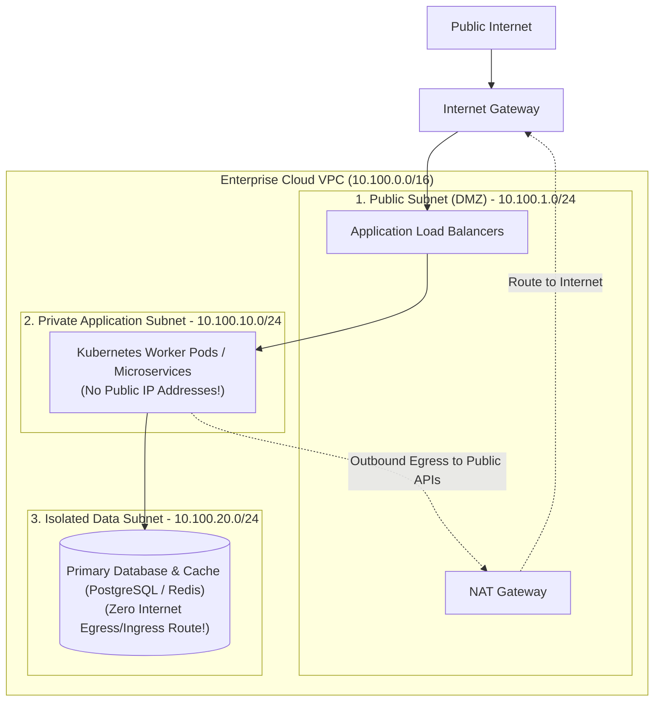

# Network Segmentation & Micro-segmentation

> **Domain**: `00-foundations/networking`  
> **Status**: Approved  
> **Target Audience**: Solution Architects, Security Architects, Cloud Infrastructure Leads

---

## 1. Simple Explanation

**Network Segmentation** is the architectural practice of dividing a single large enterprise network into smaller, isolated subnetworks (zones) separated by security firewalls.

Without segmentation, an attacker who compromises a single low-security web server can pivot laterally across the flat network to attack mission-critical customer databases. With segmentation, trust boundaries prevent unauthorized lateral movement.

---

## 2. The 3-Tier Enterprise VPC Segmentation Pattern

The industry standard architecture for a secure Virtual Private Cloud (VPC):



### The 3 Subnet Tiers Defined
1. **Public Subnet (DMZ)**:
   * Has an explicit route to the cloud Internet Gateway (`0.0.0.0/0 -> igw`).
   * Hosts **only** load balancers and NAT Gateways. **Zero application containers or databases are ever placed here.**
2. **Private Application Subnet**:
   * Has zero public IP addresses.
   * Can initiate outbound connections to the internet (e.g., to fetch third-party API data) strictly via the NAT Gateway.
   * Inbound connections permitted only from the public load balancer.
3. **Isolated Database Subnet**:
   * Has **no route to the internet** (no Internet Gateway, no NAT Gateway).
   * Fully isolated; can only receive inbound TCP connections on port 5432 strictly from the application security group. Even if an attacker gains root on a database host, they cannot exfiltrate data directly to the internet!

---

## 3. Micro-segmentation inside Kubernetes

Traditional network segmentation stops at the VM or subnet level. Inside a shared Kubernetes cluster, however, all pods can talk to all other pods by default over a flat virtual network.

### The Solution: Kubernetes NetworkPolicies & eBPF (Cilium)
**Micro-segmentation** enforces firewall rules at the individual container/pod level:

```yaml
# Example: Deny all ingress to billing-service EXCEPT from order-service
apiVersion: networking.k8s.io/v1
kind: NetworkPolicy
metadata:
  name: billing-pod-allow-order-only
  namespace: production
spec:
  podSelector:
    matchLabels:
      app: billing-service
  policyTypes:
  - Ingress
  ingress:
  - from:
    - podSelector:
        matchLabels:
          app: order-service
    ports:
    - protocol: TCP
      port: 8080
```

Any other pod in the cluster (e.g., a compromised frontend blog container) attempting to connect to the billing pod has its network packets dropped directly in the Linux kernel via **eBPF**!
