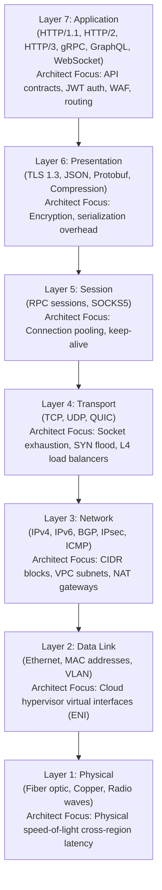

# The OSI Model: An Architect's Practical Perspective

> **Domain**: `00-foundations/networking`  
> **Status**: Approved  
> **Target Audience**: Solution Architects, Platform Engineers, Cloud Architects

---

## 1. Simple Explanation

The **Open Systems Interconnection (OSI) Model** is a conceptual framework that divides network communications into seven distinct layers. While network engineers care about electrical voltages and cable specifications, a Solution Architect cares about the layers where software protocols, security boundaries, and traffic routing intersect.

---

## 2. The 7 Layers Through an Architect's Lens

---

## 3. Deep Dive: Where Architectural Decisions Actually Live

In enterprise software engineering, 95% of architectural choices occur across three specific layers:

### 3.1 Layer 7 (Application Layer)
* **What Lives Here**: Envoy, Nginx, AWS Application Load Balancer (ALB), Kong API Gateway, WAFs, OpenAPI, GraphQL.
* **Architectural Capability**: Content-based routing (e.g., route `/payments` to Payment cluster and `/users` to User cluster); JWT token claims validation; TLS termination; HTTP request header manipulation.
* **Trade-off**: Higher CPU latency overhead due to decrypting TLS and parsing HTTP headers.

### 3.2 Layer 4 (Transport Layer)
* **What Lives Here**: AWS Network Load Balancer (NLB), HAProxy (TCP mode), Linux IPVS, Kubernetes NodePort.
* **Architectural Capability**: Line-rate packet forwarding based solely on IP and Port. High-throughput database clustering, Kafka ingress, raw TCP socket streaming.
* **Trade-off**: Zero visibility into HTTP headers, URIs, or authentication tokens.

### 3.3 Layer 3 (Network Layer)
* **What Lives Here**: Virtual Private Clouds (VPC), Subnets, Route Tables, VPN tunnels, AWS Transit Gateway.
* **Architectural Capability**: Isolation of sensitive databases from public subnets; non-overlapping CIDR blocks (`10.0.0.0/16`); enterprise perimeter defense.

---

## 4. Production Architectural Gotcha: Layer Mismatches

**The "Broken Keep-Alive" Outage**: An architect configures a Layer 7 Load Balancer with an idle keep-alive timeout of **60 seconds**, while the downstream backend web server has an idle keep-alive timeout of **15 seconds**.  
* *What happens*: At second 16, the backend server quietly closes the TCP connection (Layer 4). But the load balancer still believes the connection is open (Layer 7). When a client request arrives, the load balancer reuses the dead socket; the backend responds with a TCP `RST`; the client receives an intermittent `502 Bad Gateway`.
* **Architectural Rule**: The idle timeout of upstream proxies must always be configured **shorter** than the idle timeout of downstream backends!
