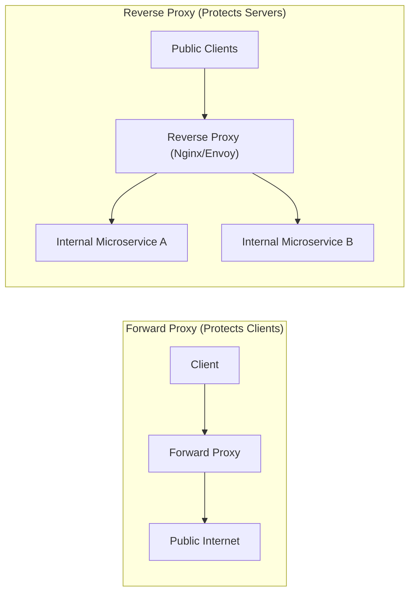

# Reverse Proxies & Ingress Gateways

> **Domain**: `00-foundations/networking`  
> **Status**: Approved  
> **Target Audience**: Solution Architects, Platform Engineers, Infrastructure Engineers

---

## 1. Simple Explanation

A **Forward Proxy** sits in front of *clients* to protect their identity and control outbound internet access (e.g., a corporate proxy blocking social media).  
A **Reverse Proxy** sits in front of *servers* to intercept incoming client traffic, acting as a single public front door that protects, optimizes, and routes traffic to backend internal services.



---

## 2. Architect-Level Deep Dive: Core Capabilities

1. **TLS / SSL Termination**: Offloads expensive cryptographic handshakes from application pods to optimized edge reverse proxy nodes (using hardware crypto acceleration).
2. **Buffer Slow Clients (Mitigating Slowloris Attacks)**: If a mobile user is uploading a large file over a slow 2G connection, the reverse proxy buffers the incoming HTTP bytes. It only contacts the backend application server once the entire payload has arrived, protecting backend worker threads from being held hostage.
3. **URL Rewriting & Path-Based Routing**:
   * `https://enterprise.com/api/orders/*` $\to$ routed to Order Service Pods.
   * `https://enterprise.com/api/billing/*` $\to$ routed to Billing Service Pods.
4. **Static Asset Caching & Compression**: Compresses payloads using Gzip / Brotli and caches CSS, JS, and images in RAM.
5. **Rate Limiting & IP Blacklisting**: Intercepts abusive scrapers or DDoS bots before they touch expensive application databases.

---

## 3. Technology Evaluation: Nginx vs. HAProxy vs. Envoy

```text
┌─────────────────────────────────────────────────────────────┐
│                 REVERSE PROXY TECHNOLOGY MATRIX             │
├───────────────┬─────────────────────────────────────────────┤
│ REVERSE PROXY │ ARCHITECTURAL FIT                           │
├───────────────┼─────────────────────────────────────────────┤
│ Nginx         │ Battle-tested, excellent static asset       │
│               │ caching, web serving, and basic L7 ingress. │
├───────────────┼─────────────────────────────────────────────┤
│ HAProxy       │ Extreme raw throughput, best-in-class L4/L7 │
│               │ TCP connection queuing and load balancing.  │
├───────────────┼─────────────────────────────────────────────┤
│ Envoy         │ The cloud-native standard. C++ core, native │
│               │ gRPC, dynamic xDS API configuration without │
│               │ restarts, built-in OpenTelemetry tracing.   │
└───────────────┴─────────────────────────────────────────────┘
```

---

## 4. Production Architectural Gotchas

### The `X-Forwarded-For` Header Spoofing Vulnerability
When a reverse proxy terminates TLS and forwards the request to a backend microservice, the backend sees the proxy’s internal IP (`10.0.1.5`) rather than the client’s real IP address (`203.0.113.19`).
* The proxy appends the client IP to the `X-Forwarded-For` header.
* **The Security Trap**: If an attacker sends a fake `X-Forwarded-For: 127.0.0.1` header, and your reverse proxy naively appends to it without stripping untrusted upstream headers, backend services that check IP whitelists can be bypassed!
* **Remedy**: Configure `use_x_forwarded_for` only from strictly trusted proxy CIDR ranges.
