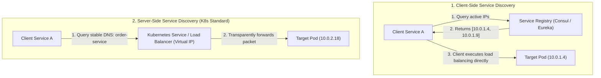

# Service Discovery: Client-Side vs. Server-Side

> **Domain**: `00-foundations/networking`  
> **Status**: Approved  
> **Target Audience**: Solution Architects, Distributed Systems Engineers, Platform Engineers

---

## 1. Simple Explanation

In traditional legacy hosting, servers had static, immutable IP addresses (`10.0.0.15`).  
In modern cloud-native architectures with autoscaling, container restarts, and spot instance terminations, **pod IP addresses change every minute**. **Service Discovery** is the automated mechanism that allows Service A to locate and communicate with the dynamically changing IP addresses of Service B.

---

## 2. Architect-Level Deep Dive: Client-Side vs. Server-Side Discovery

```text
┌─────────────────────────────────────────────────────────────┐
│                 SERVICE DISCOVERY TAXONOMY                  │
├───────────────────────────────┬─────────────────────────────┤
│ CLIENT-SIDE DISCOVERY         │ SERVER-SIDE DISCOVERY       │
├───────────────────────────────┼─────────────────────────────┤
│ Client queries registry       │ Client queries a stable     │
│ directly and selects an IP.   │ virtual IP / Load Balancer. │
│ Netflix Eureka, Ribbon, Finagle│ AWS ALB, Kubernetes CoreDNS │
│ + Smart Client SDKs           │ + kube-proxy / Envoy Mesh   │
└───────────────────────────────┴─────────────────────────────┘
```



---

## 3. Comparison of Models

### 3.1 Client-Side Discovery
* **Mechanics**: The client application imports a thick SDK (e.g., Netflix Eureka + Ribbon). On startup, backend instances register their IP with the service registry. The client fetches the IP list, caches it locally, runs its own load-balancing algorithm, and connects directly to the target instance.
* **Trade-offs**:
  * *Advantage*: Bypasses intermediate load balancer hops; lower latency.
  * *Disadvantage*: **Polyglot Nightmare**. You must write and maintain client discovery libraries for Java, .NET, Python, Go, and Node.js. If an engineer introduces a bug in the Go SDK, traffic imbalances occur.

### 3.2 Server-Side Discovery (The Cloud-Native Standard)
* **Mechanics**: The client simply makes an HTTP/gRPC call to a standard, static DNS name: `http://order-service.production.svc.cluster.local`. An intermediate router (Kubernetes `kube-proxy` via iptables/IPVS, or a cloud load balancer) resolves the request and routes it to an active pod.
* **Trade-offs**:
  * *Advantage*: Completely language-agnostic. Any technology that can execute standard HTTP or DNS queries works seamlessly.
  * *Disadvantage*: Adds an extra network hop and requires managing load balancer infrastructure.

---

## 4. Modern Service Discovery: Kubernetes CoreDNS + Service Mesh

In modern enterprise architectures, service discovery has converged on a hybrid model:
1. **Kubernetes CoreDNS**: Provides static domain names for services.
2. **Sidecar Service Mesh (Envoy / Istio)**: Envoy sidecars intercept outbound traffic transparently using `iptables`, query the control plane for real-time endpoint health, and perform client-side load balancing with P2C (Power of Two Random Choices)—combining the simplicity of server-side discovery with the performance of client-side load balancing!
