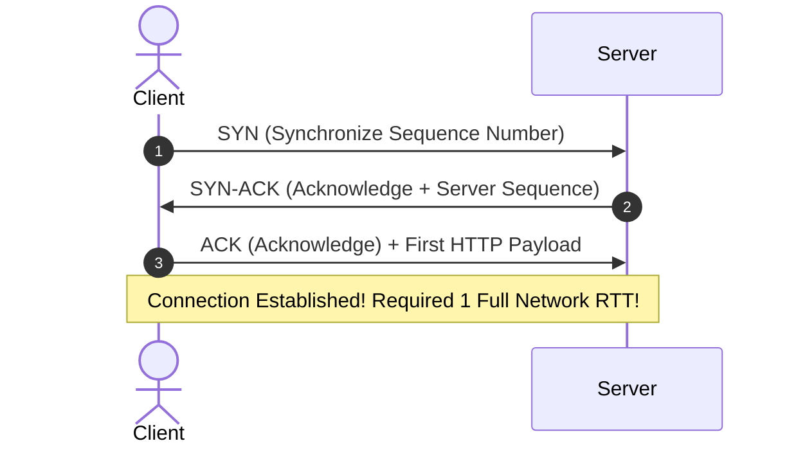
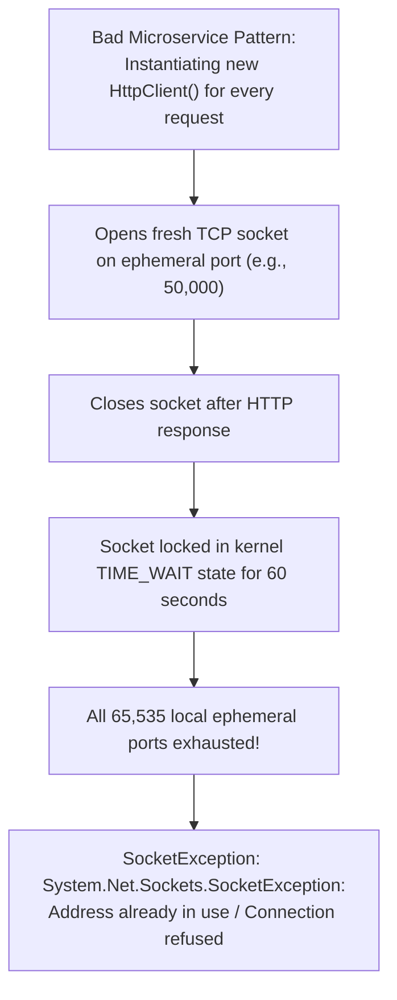

# TCP/IP Internals for Solution Architects

> **Domain**: `00-foundations/networking`  
> **Status**: Approved  
> **Target Audience**: Solution Architects, Principal Backend Engineers, Platform Engineers

---

## 1. Simple Explanation

**TCP (Transmission Control Protocol)** is the reliable, connection-oriented workhorse of the internet. It guarantees that bytes sent across an unreliable network arrive in the exact same order, with zero missing or corrupted bytes, handling retransmissions and congestion control under the hood.

---

## 2. The TCP 3-Way Handshake & The Latency Tax

Before a single application byte (HTTP GET or POST) can be transmitted, TCP must establish a connection via the **3-Way Handshake**:

### The Speed-of-Light Penalty
* If a mobile user in Sydney connects to an API in Virginia (Round-Trip Time $RTT \approx 200\text{ms}$):
  * TCP Handshake = $200\text{ms}$.
  * TLS 1.3 Handshake = $200\text{ms}$.
  * HTTP Request/Response = $200\text{ms}$.
* **The user waits 600ms before seeing the first byte of data!**
* **Architectural Remedy**:
  1. **Connection Pooling & HTTP Keep-Alive**: Reuse established TCP sockets across requests.
  2. **Edge Termination / CDN**: Terminate TCP and TLS handshakes at an edge server in Sydney ($RTT \approx 10\text{ms}$); route traffic back to Virginia over optimized private backbone fibers.

---

## 3. TCP Head-of-Line (HoL) Blocking

TCP guarantees in-order delivery of the byte stream:
* If packet #3 of an HTTP stream drops due to a momentary blip, **the operating system kernel buffers packets #4, #5, and #6 in memory and refuses to hand them to the application** until packet #3 is retransmitted and acknowledged.
* In HTTP/2 (which multiplexes 50 concurrent API calls over a single TCP socket), **a single dropped packet freezes all 50 concurrent API requests simultaneously!**
* *The Modern Solution*: **HTTP/3 over QUIC/UDP**, which implements stream-level framing directly in userspace, eliminating TCP Head-of-Line blocking entirely.

---

## 4. Socket Exhaustion: The `TIME_WAIT` Trap

When an application closes a TCP connection, the operating system kernel places the socket into a **`TIME_WAIT`** state for a duration of $2 \times \text{MSL}$ (Maximum Segment Lifetime), typically **60 seconds**, to ensure late-arriving packets are not mistakenly delivered to a new connection.

### Production Architectural Remedy
* **Never create ad-hoc HTTP clients per request** (e.g., `new HttpClient()` in .NET or `HttpURLConnection` in Java).
* Always utilize a managed, singleton **Connection Pool** (`IHttpClientFactory` in .NET, Apache `PoolingHttpClientConnectionManager` in Java, or Keep-Alive connection pools in Go/Node.js).
