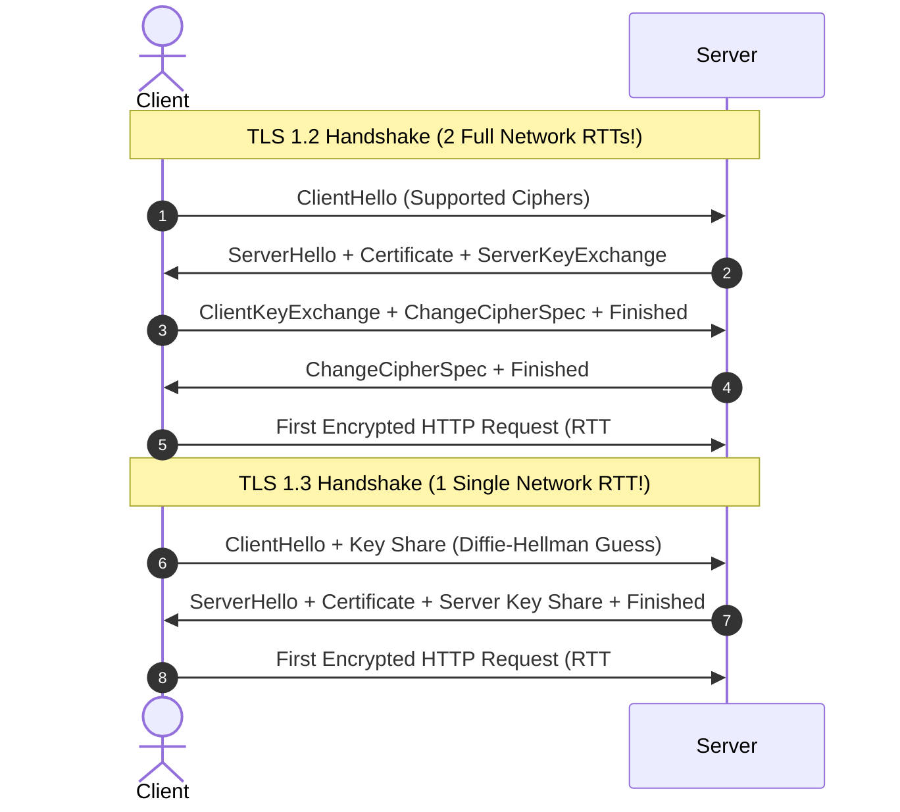
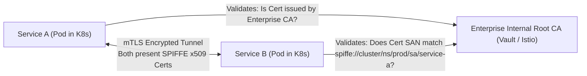

# TLS 1.2 vs. TLS 1.3 & Mutual TLS (mTLS)

> **Domain**: `00-foundations/networking`  
> **Status**: Approved  
> **Target Audience**: Solution Architects, Security Architects, Platform Engineers

---

## 1. Simple Explanation

**TLS (Transport Layer Security)** is the cryptographic protocol that secures internet communication (the "S" in HTTPS). It provides three non-negotiable guarantees:
1. **Privacy / Confidentiality**: Prevents eavesdroppers from reading data in transit via symmetric encryption (AES-256-GCM / ChaCha20).
2. **Integrity**: Prevents man-in-the-middle tampering using cryptographic message authentication (HMAC-SHA256).
3. **Authentication**: Proves the server's identity using digital x509 public-key certificates.

---

## 2. TLS 1.2 vs. TLS 1.3 Handshake Mechanics

TLS 1.3 (RFC 8446, 2018) achieved a massive breakthrough in both security and latency:

### Key Architectural Upgrades in TLS 1.3
1. **Halved Handshake Latency**: Reduced full cryptographic negotiation from **2 RTTs to 1 RTT**.
2. **Elimination of Obsolete Cryptography**: Stripped insecure legacy algorithms (RSA key exchange, CBC ciphers, RC4, MD5, SHA-1). Only modern Authenticated Encryption with Associated Data (AEAD) ciphers are permitted.
3. **Mandatory Forward Secrecy**: Uses ephemeral Diffie-Hellman (ECDHE). Even if an attacker steals the server's private key 5 years later, previously recorded network traffic **cannot be decrypted**.

---

## 3. Mutual TLS (mTLS) in Zero Trust Architecture

In standard one-way TLS, the server proves its identity to the client (e.g., your browser verifies your bank's certificate). The server does not care which client machine is connecting.

In enterprise **Mutual TLS (mTLS)**, **both client and server present and cryptographically validate each other's x509 digital certificates.**

### Why mTLS is Mandatory for Modern Microservices
* **Perimeter Networks are Obsolete**: Inside a Kubernetes cluster or VPC, malicious actors or compromised pods can sniff unencrypted east-west network traffic.
* **Identity-First Security**: mTLS provides cryptographically unforgeable service identity independent of IP addresses (which change constantly in cloud autoscaling).
* **Automatic mTLS via Service Mesh**: Istio, Linkerd, or Envoy automatically inject sidecar proxies that handle certificate rotation, mTLS handshakes, and encryption transparently without requiring application code changes.
