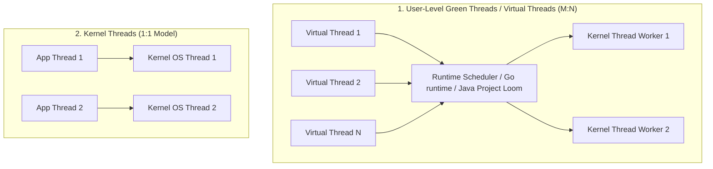

# Operating Systems Architecture: Runtimes, Resource Limits, and Kernel Primitives

## 1. Architectural Overview & Context
For software and systems architects, the Operating System (OS) is not an abstract black box; it is the physical executor that allocates CPU cycles, isolates processes, manages memory hierarchies, and multiplexes network sockets.

Architectural failures in high-scale production systems—such as thread starvation, memory thrashing, unexpected socket timeouts, and container OOM-kills—frequently stem from designing applications without understanding the underlying OS kernel primitives.

```
┌─────────────────────────────────────────────────────────────────────────────┐
│                 THE RUNTIME TO HARDWARE INTERFACE STACK                     │
├─────────────────────────────────────────────────────────────────────────────┤
│ Application Code (Java / .NET / Python / Go / Node.js)                      │
│ Language Runtime (JVM Garbage Collector, CLR JIT, V8 Event Loop)            │
│ Standard C Library (glibc / musl) & System Calls (syscalls)                 │
│ Linux / Windows Kernel (Scheduler, Memory Manager, TCP Stack, VFS)          │
│ Hardware Boundary (CPU Rings, MMU, TLB, L1/L2/L3 Caches, NVMe, NIC)        │
└─────────────────────────────────────────────────────────────────────────────┘
```

---

## 2. Process vs. Thread Concurrency Models

Application throughput is governed by how language runtimes map threads to kernel threads:



| Dimension | 1:1 OS Thread Model (Classic Java/C#) | M:N Virtual Threads (Go / Java 21+ Loom) | Event-Driven Non-blocking (Node.js / Netty) |
|---|---|---|---|
| **Memory Footprint** | $1\text{MB} - 2\text{MB}$ stack per thread | $\approx 2\text{KB} - 4\text{KB}$ stack per virtual thread | Single main thread + thread pool for async I/O |
| **Concurrency Limit**| Thousands of threads per node | Millions of concurrent virtual threads | Tens of thousands of concurrent open sockets |
| **Context Switch Cost**| High ($1\text{µs} - 3\text{µs}$ kernel transition) | Very Low ($< 50\text{ns}$ in user space) | Zero thread context switches on main loop |
| **CPU-Bound Fit** | Excellent (Direct OS core scheduling) | Poor (Virtual threads yield on I/O, not CPU) | Poor (Long computations block entire event loop) |
| **I/O-Bound Fit** | Poor (Threads block on socket reads) | Exceptional (Seamless blocking syntax under the hood) | Exceptional (Reactor pattern / asynchronous callbacks) |

---

## 3. Memory Architecture: Virtual Memory, Paging, and OOM

### 3.1. Virtual Memory & Page Faults
The OS provides each process with an isolated virtual address space. Physical RAM is mapped in chunks (typically **4KB pages**):
* **Minor Page Fault**: The virtual page is valid in memory, but not yet mapped to the process MMU (fast).
* **Major Page Fault**: The requested page is not in physical RAM and must be fetched from disk or swap space.
  > **Architectural Impact**: A single major page fault introduces an I/O penalty of **$5\text{ms} - 15\text{ms}$** (HDD) or **$50\text{µs} - 100\text{µs}$** (NVMe), stalling low-latency application threads.

### 3.2. Container OOM-Kills (Out of Memory)
In Kubernetes and Docker, the Linux kernel's **OOM Killer** inspects container memory limits defined by `cgroups`. When a container's resident memory breaches `limits.memory`:
* The Linux kernel sends `SIGKILL` (Exit Code `137`) instantly to the primary process.
* **Architecture Rule**: For JVM applications, always configure `-XX:MaxRAMPercentage=75.0` to leave 25% of container memory for off-heap allocations (Netty buffers, Metaspace, thread stacks, glibc malloc).

---

## 4. Socket I/O Multiplexing: From `select` to `epoll` and `IOCP`

High-throughput network services (API gateways, reverse proxies, message brokers) rely on kernel I/O multiplexing:

```
Blocking I/O (Thread-per-connection)              I/O Multiplexing (epoll / kqueue / IOCP)
┌───────────────────────────────────────┐         ┌───────────────────────────────────────┐
│ 10,000 Connections                    │         │ 10,000 Connections                    │
│   ├── 10,000 OS Threads               │         │   ├── Registered with single epoll fd │
│   └── 10–20 GB RAM consumed in stacks │         │   └── Kernel wakes worker thread ONLY │
│   └── Scheduler thrashing & collapse  │         │       when socket has readable bytes  │
└───────────────────────────────────────┘         └───────────────────────────────────────┘
```

* **Linux `epoll` / macOS `kqueue`**: $O(1)$ event notifications; handles 100,000+ idle connections with near-zero CPU overhead.
* **Windows `IOCP` (I/O Completion Ports)**: True asynchronous completion model; thread is notified only *after* the OS has transferred bytes into application buffers.

---

## 5. Linux Containers vs. Virtual Machines (cgroups & namespaces)

Containers are not lightweight virtual machines; they are ordinary Linux processes running under kernel constraints:

```mermaid
flowchart TD
    subgraph VM["Virtual Machine Architecture (Hypervisor Isolation)"]
        VMApp[Application] --> VMGuestOS[Guest OS Kernel]
        VMGuestOS --> Hypervisor[Type 1/2 Hypervisor: KVM / ESXi]
        Hypervisor --> HostHW1[Host Hardware]
    end

    subgraph Container["Container Architecture (Kernel Resource Isolation)"]
        CApp[Application Container] --> Namespaces[Linux Namespaces: PID, NET, MNT, IPC]
        Namespaces --> Cgroups[Linux cgroups v2: CPU, Memory, I/O Limits]
        Cgroups --> HostKernel[Shared Host Linux Kernel]
        HostKernel --> HostHW2[Host Hardware]
    end
```



### The 6 Core Linux Namespaces:
1. **PID**: Isolates process ID tree (container process thinks it is PID 1).
2. **NET**: Isolates network interfaces, routing tables, and firewall rules.
3. **MNT**: Isolates filesystem mount points (overlayfs container root).
4. **IPC**: Isolates inter-process shared memory segments and message queues.
5. **UTS**: Isolates hostnames and domain names.
6. **USER**: Maps container `root` (UID 0) to an unprivileged UID on the host for defense-in-depth.

---

## 6. Operating Systems Architecture Checklist
- [ ] Align application concurrency model (1:1 threads vs Virtual Threads vs Event Loop) with workload I/O characteristics.
- [ ] Configure JVM/Node.js memory caps to never exceed 75% of container cgroup memory limits.
- [ ] Tune OS socket backlog limits (`somaxconn`, `tcp_max_syn_backlog`) on high-throughput reverse proxies.
- [ ] Set kernel open file descriptor limits (`ulimit -n` / `nofile`) to a minimum of 65,535 for networking services.
- [ ] Run containers as unprivileged users using Linux User Namespaces to mitigate container breakout attacks.
- [ ] Profile production latency anomalies using low-overhead kernel tracing tools (eBPF, `perf`, `strace`).

---

## 7. Related Modules
* [08-cloud/cloud-native/](../../08-cloud/cloud-native/README.md) — Kubernetes orchestration, cgroups allocation, and pod scheduling.
* [03-backend/](../../03-backend/) — Backend runtimes: Java JVM tuning, Go goroutines, and .NET CLR internals.
* [10-security/](../../10-security/) — Linux container security, seccomp profiles, and AppArmor/SELinux boundaries.
