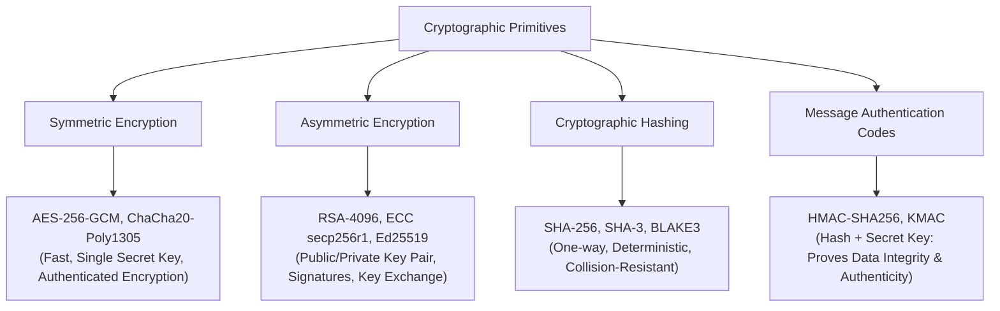
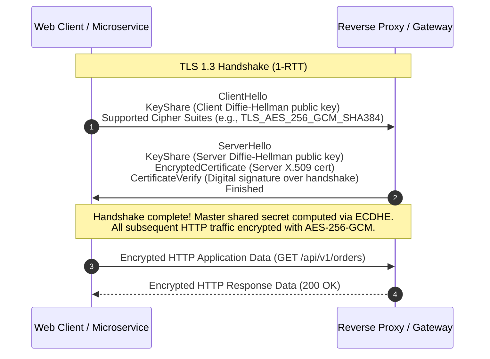

# Security Foundations for Architects: Cryptography, Identity, and Defensive Primitives

## 1. Architectural Overview & Context
Security is not a downstream feature or a checklist item to be evaluated before launch; it is a **foundational quality attribute** that must be engineered into data structures, protocol interactions, and infrastructure topologies from inception.

Architects must master the core cryptographic primitives, identity protocols, and defensive design principles to make defensible, secure-by-design decisions.

---

## 2. The CIA Triad & The Parkerian Hexad

Beyond the classical **CIA Triad**, enterprise architects evaluate security against the **Parkerian Hexad**:

```
┌─────────────────────────────────────────────────────────────────────────────┐
│                    THE PARKERIAN HEXAD OF SECURITY                          │
├─────────────────────┬───────────────────────────────────────────────────────┤
│ 1. Confidentiality  │ Preventing unauthorized disclosure of information     │
│ 2. Integrity        │ Preventing unauthorized modification or tampering     │
│ 3. Availability     │ Ensuring timely, reliable access for authorized users │
│ 4. Authenticity     │ Verifying the genuine origin of a claim or message    │
│ 5. Utility          │ Preserving the usefulness of data (e.g., encryption)  │
│ 6. Possession       │ Retaining physical/logical control of assets          │
└─────────────────────┴───────────────────────────────────────────────────────┘
```

---

## 3. Cryptographic Primitives: The Architect's Toolkit



### Critical Cryptographic Rules for Architects:
1. **Never Invent Custom Cryptography**: Always use NIST-approved or widely vetted standard algorithms and libraries (e.g., OpenSSL, libsodium).
2. **Always Use Authenticated Encryption (AEAD)**: When encrypting data, standard AES-CBC is vulnerable to padding oracle attacks. Always mandate **AES-256-GCM** or **ChaCha20-Poly1305**, which provide both confidentiality and cryptographic integrity verification in a single pass.
3. **Password Storage Standard**: Never use fast algorithms (MD5, SHA-256) for passwords. Always enforce slow, memory-hard key derivation functions: **Argon2id** (preferred) or **bcrypt** with appropriate work factors.

---

## 4. Modern Transport Security: TLS 1.3 Handshake Architecture

TLS 1.3 drastically improves both latency and security over TLS 1.2 by reducing the handshake to a **single round-trip (1-RTT)** and eliminating obsolete, insecure cipher suites (e.g., RSA key exchange, RC4, 3DES):



### Forward Secrecy (Ephemeral Diffie-Hellman)
TLS 1.3 mandates **PFS (Perfect Forward Secrecy)** via ephemeral key exchange (ECDHE). Even if an adversary steals the server's private RSA certificate in the future, they cannot retroactively decrypt past captured network traffic.

---

## 5. Defense-in-Depth & Secure Defaults

Architecting defensively requires structuring security in concentric layers so that a failure in one layer is contained by the next:

```
┌─────────────────────────────────────────────────────────────┐
│                    DEFENSE-IN-DEPTH LAYERS                  │
├─────────────────────────────────────────────────────────────┤
│ 1. Edge / Perimeter  │ Cloudflare WAF, DDoS mitigation      │
│ 2. Network Boundary  │ Private VPC subnets, NetworkPolicies │
│ 3. Host / Node       │ Hardened OS images, SELinux, eBPF    │
│ 4. Application       │ OIDC AuthN, ABAC AuthZ, Input Schema │
│ 5. Process           │ Unprivileged containers, Seccomp     │
│ 6. Data              │ Envelope Encryption, KMS DEK, DLP    │
└─────────────────────────────────────────────────────────────┘
```

### The Principle of Least Privilege:
Every module, service account, and human operator must access only the minimal set of resources required to execute their specific function, for the shortest duration necessary.

---

## 6. Security Foundations Checklist
- [ ] Enforce TLS 1.3 with Perfect Forward Secrecy across all public and internal service APIs.
- [ ] Mandate AEAD cipher modes (AES-256-GCM) for all data-at-rest encryption.
- [ ] Store user passwords exclusively using Argon2id or bcrypt with high work factors.
- [ ] Implement short-lived credentials ($\le 1\text{h}$) backed by automated IAM role assumption.
- [ ] Sign webhook and message payloads using HMAC-SHA256 to ensure authenticity.
- [ ] Embed automated SAST/DAST and dependency vulnerability scanners directly into CI/CD.

---

## 7. Related Modules
* [01-architecture/security-architecture/](../../01-architecture/security-architecture/README.md) — Zero Trust, STRIDE threat modeling, and envelope encryption.
* [10-security/](../../10-security/) — Implementation playbooks: application security, vulnerability management, and secret stores.
* [05-mobile/mobile-security/](../../05-mobile/mobile-security/README.md) — Mobile threat models, Secure Enclave, and certificate pinning.
