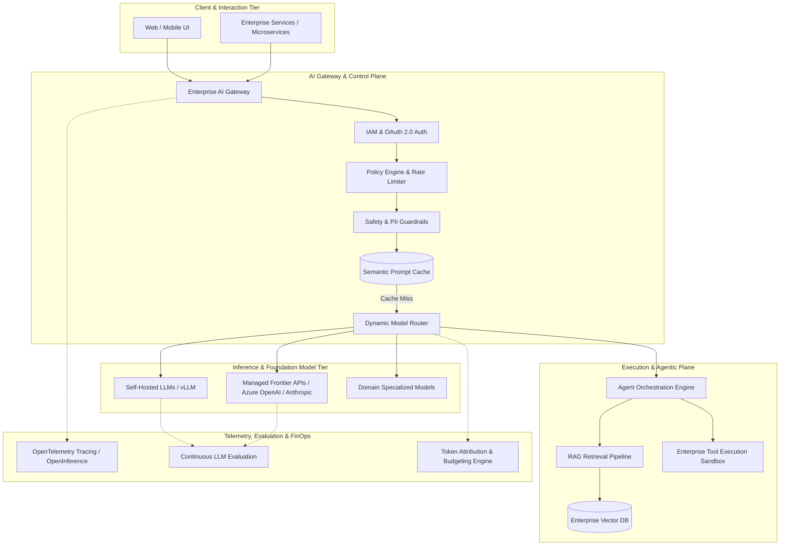

# Enterprise AI Architecture: Systems, Platforms, and Governance

## 1. Architectural Overview & Context
Enterprise AI Architecture addresses the structural design, deployment, and operational governance of machine learning (ML), large language models (LLMs), and agentic workflows across enterprise boundaries.

A common failure mode in enterprise adoption is conflating an **AI Application** (a single feature like customer support chat) with an **Enterprise AI Platform** (a multi-tenant, observable, secure, and governed runtime supporting dozens of business workloads).

```
┌─────────────────────────────────────────────────────────────────────────────┐
│                          ENTERPRISE AI TAXONOMY                             │
├─────────────────────────┬───────────────────────────────────────────────────┤
│ Tier 1: AI Application  │ Point solutions (e.g., Doc Summarizer, Chatbot)   │
│ Tier 2: AI System       │ Composed workflows (RAG pipeline + Vector DB)     │
│ Tier 3: AI Platform     │ Shared infrastructure (Gateway, Cache, Eval, Fin) │
│ Tier 4: Enterprise AI   │ Cross-cutting governance, model registry, policy  │
└─────────────────────────┴───────────────────────────────────────────────────┘
```

---

## 2. Enterprise AI Architecture Blueprint



---

## 3. Core Architectural Subsystems

### 3.1. Enterprise AI Gateway
The gateway provides a single ingress control plane for all external and internal model requests:
* **Protocol Normalization**: Exposes OpenAI-compatible REST/gRPC endpoints regardless of backend provider.
* **Semantic Caching**: Hashes prompt vector embeddings to return cached responses for semantically identical questions (similarity threshold $\ge 0.96$), reducing external API spend by 25–40%.
* **Fallback & Load Balancing**: Automatically routes around provider outages or quota breaches (`HTTP 429`) with zero client-side configuration.

### 3.2. RAG (Retrieval-Augmented Generation) Architecture
```
Documents → Chunking → Embedding Model → Vector Index
                                             ↓
User Query → Query Embedding → Hybrid Search (Vector + BM25) → Re-ranking → Context Injection → LLM
```
* **Hybrid Retrieval**: Combines dense vector similarity with sparse lexical search (BM25) to avoid catastrophic recall drops on domain-specific part numbers, acronyms, and legal identifiers.
* **Re-Ranking Stage**: Passes top-50 candidates through a cross-encoder re-ranker (e.g., Cohere Re-rank, BGE-Reranker) before injecting the top-5 into the prompt context window.

### 3.3. Agentic Architecture & Sandboxed Tool Execution
* **ReAct Pattern**: Agents interleave reasoning traces with actions (`Thought` → `Action` → `Observation`).
* **Isolated Tool Sandboxing**: External API calls and code interpretation must execute in ephemeral, network-restricted containers (e.g., Firecracker microVMs or gVisor) with strict egress filtering.

---

## 4. Decision Framework: Model Hosting Strategy

| Dimension | Commercial Managed API (Azure/OpenAI/GCP) | Self-Hosted Open-Source (vLLM / Triton) | Hybrid Enterprise Pattern |
|---|---|---|---|
| **Data Privacy** | Model provider contractual zero-retention | 100% air-gapped on-premises or private VPC | PII-redacted queries to cloud; sensitive data on private VPC |
| **Time to Market** | Days (Immediate API access) | Weeks (GPU provisioning, scaling, MLOps) | Managed APIs for PoC, self-hosted for high-volume steady state |
| **Unit Cost at Scale** | Linear per-token cost ($/1M tokens) | High fixed GPU cost; near-zero marginal token cost | Self-hosted base models with managed fallback |
| **Customization** | System prompts, fine-tuning APIs | Full weights access, LoRA adapters, custom quantization | Custom fine-tuned LoRA deployed on private vLLM clusters |

---

## 5. Architectural NFRs, Failure Modes & Mitigations

### 5.1. Token Cost Runaway
* **Risk**: Unbounded agentic recursion or high-velocity consumer traffic exhausts monthly API budgets within hours.
* **Mitigation**: Strict hard limits on maximum tokens per tenant/day, max agent loop iterations (default: 5), and circuit breaking when spend velocity exceeds $150\%$ of baseline.

### 5.2. Prompt Injection & PII Leakage
* **Risk**: Malicious input overrides system instructions to exfiltrate proprietary data or PII.
* **Mitigation**: Dual-guardrail architecture: Input sanitizer (Llama Guard / NeMo Guardrails) before model execution, and deterministic regex/entropy DLP scanning on output tokens before returning to client.

### 5.3. Latency & Time-To-First-Token (TTFT)
* **Risk**: High latency (>3000ms) on synchronous UI interactions creates unacceptable user experience.
* **Mitigation**: Enforce Server-Sent Events (SSE) streaming for all UI consumers; parallelize vector retrieval and query decomposition.

---

## 6. Enterprise Production Checklist
- [ ] Centralize all model requests through the Enterprise AI Gateway with API key rotation.
- [ ] Enforce automated PII stripping at the gateway before external model dispatch.
- [ ] Implement semantic prompt caching with a high similarity threshold ($\ge 0.96$).
- [ ] Bind every model request to a business department code for FinOps cost allocation.
- [ ] Configure automated model fallback routes for HTTP 429 / 5xx provider failures.
- [ ] Monitor LLM telemetry via OpenTelemetry/OpenInference (TTFT, total latency, token count, cost).

---

## 7. Related Modules
* [12-ai/model-serving/](../../12-ai/model-serving/README.md) — Low-level inference engines, GPU allocation, quantization, and vLLM.
* [10-security/](../../10-security/) — Threat modeling, prompt injection defense, and cryptographic key management.
* [23-enterprise-architecture/](../../23-enterprise-architecture/) — Strategic architecture roadmaps and IT portfolio alignment.
