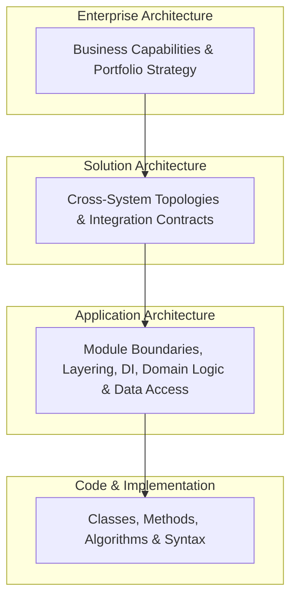

# Application Architecture Overview

## 1. What Problem Does This Solve?
Software systems suffer from **architectural entropy**: over time, pressure to deliver features rapidly causes code to bypass boundaries, create circular dependencies, and leak infrastructure into domain logic. Without an intentional application architecture, systems degrade into unmaintainable "Big Balls of Mud" where a change in one feature unpredictably breaks unrelated functionality.

---

## 2. The Architectural Hierarchy

---

## 3. Core Concerns of Application Architecture

1. **Boundary Integrity**: Establishing clear firewalls between user interfaces, core business rules, and external systems.
2. **Dependency Direction**: Forcing dependencies inward toward business logic (Dependency Inversion Principle).
3. **State & Concurrency Management**: Ensuring deterministic mutations and thread safety across async workflows.
4. **Lifecycle Control**: Orchestrating application startup, configuration hydration, dependency wiring, and graceful termination.
