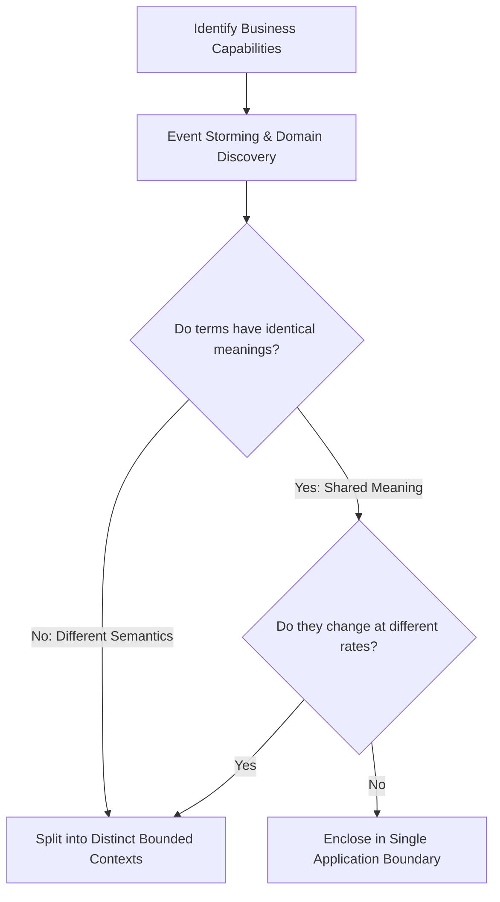

# Application Boundaries & Component Perimeters

## 1. Executive Summary
An application boundary defines the perimeter of a cohesive functional component. It establishes what is public (accessible by outside callers) and what is private (encapsulated internal logic). 

Failing to enforce application boundaries turns a monolithic codebase into an untangleable web of circular calls, making refactoring or microservice extraction virtually impossible.

---

## 2. How an Architect Decides Application Boundaries

### The Boundary Decision Criteria:
1. **Semantic Divergence**: If the word `Product` means a physical package to Shipping, but a pricing ledger to Billing, they belong in separate boundaries.
2. **Rate of Change (Volatility)**: Separate rapidly changing marketing logic from core, stable financial ledger algorithms.
3. **Team Ownership (Conway's Law)**: Align boundary perimeters with team structures. A boundary should ideally be owned by a single cross-functional team.
4. **Failure Blast Radius**: Critical transactional paths (Checkout) must be isolated from non-critical paths (Product Recommendations).

---

## 3. Boundary Enforcement Mechanisms

- **Package/Assembly Encapsulation**: Use internal/package-private classes in Java, C#, or Go so only public Facades or Contracts are visible across boundaries.
- **Contract DTOs**: Never expose internal database entities or domain aggregate roots across a boundary.
