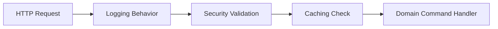

# Application Composition & Behavioral Assembly

## 1. Composition Over Inheritance

Class inheritance introduces **White-Box Reuse**: subclasses know and depend on parent class implementation details. If a parent class method changes, subclasses fail silently.

**Composition** provides **Black-Box Reuse**: components expose interfaces and are combined dynamically via dependency injection.

---

## 2. The Decorator / Pipeline Composition Pattern

Using pipeline behaviors (e.g., MediatR behaviors in .NET, Spring AOP interceptors in Java):
- Cross-cutting concerns (logging, metrics, transactions, retries) are composed around pure domain handlers without contaminating domain code with boilerplate.
