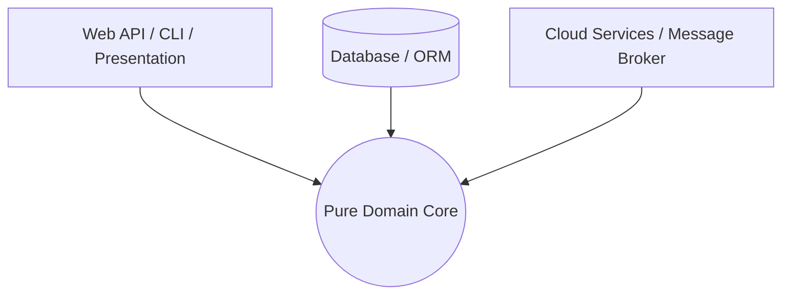

# Application Dependency Management

## 1. The Core Rule: Inward Dependency Direction

In modern application engineering (Clean Architecture, Hexagonal, Onion), the universal rule is:

> **Source code dependencies must point inward, toward the higher-level domain policies.**



Nothing in the Domain Core can depend on frameworks, databases, or UI libraries.

---

## 2. Dependency Inversion Principle (DIP) in Action

```
Bad (Direct Infrastructure Dependency):
[ OrderService (Business Logic) ] ──► [ SqlServerRepository (Database) ]
(Business logic cannot be tested without a running SQL Server)

Good (Inverted Dependency):
[ OrderService (Business Logic) ] ──► [ IOrderRepository (Interface) ]
                                                ▲
                                                │ (Implements)
[ SqlServerRepository (Infra) ] ────────────────┘
```
