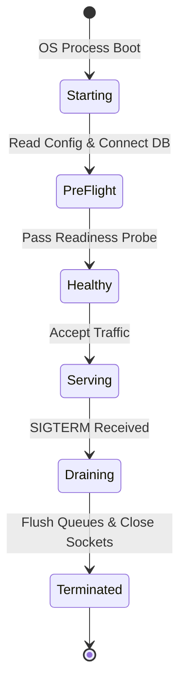

# Application Lifecycle & Graceful Termination

## 1. The Container Application Lifecycle

---

## 2. Graceful Shutdown Protocol (SIGTERM Handling)

When Kubernetes or cloud orchestrators scale down or deploy new pods:
1. Orchestrator sends `SIGTERM` signal.
2. Readiness probe immediately flips to `UNHEALTHY` (load balancer ceases sending new traffic).
3. Application allows active in-flight HTTP requests to complete within a grace window (e.g., 30 seconds).
4. Application flushes background queues and commits Kafka offsets.
5. Application closes database connection pools and terminates cleanly with exit code 0.
