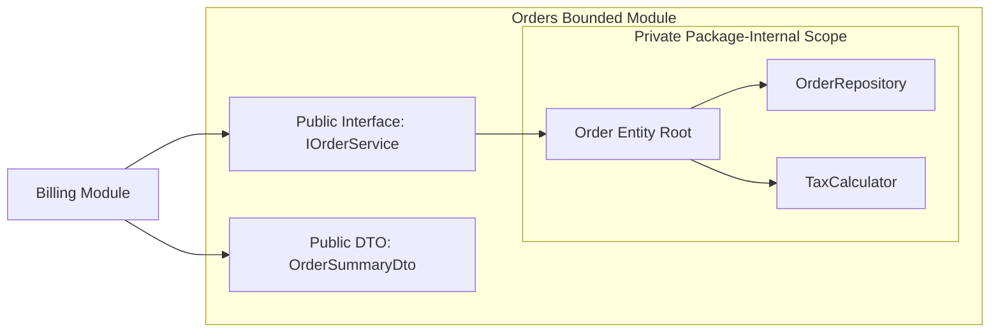

# Application Modularity & Encapsulation

## 1. Executive Summary
Modularity is the property of a software system that has been decomposed into cohesive, loosely coupled units called **modules**. A module encapsulates internal complexity behind a well-defined public contract.

---

## 2. Internal Encapsulation Blueprint

---

## 3. Structural Rules for High Modularity

1. **Only Export Interfaces & DTOs**: Never expose internal domain classes or data persistence models.
2. **Zero Direct Database Sharing**: Modules must never read or write to another module's database tables or schema.
3. **Module Communication via Events or Contracts**: Synchronous communication uses public interfaces; asynchronous communication uses domain/integration events.
