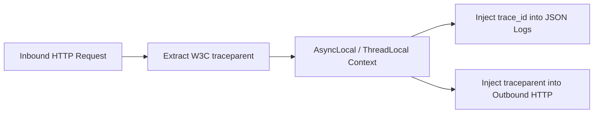

# Application Observability Architecture

## 1. Telemetry Context Propagation

For distributed tracing across microservices, telemetry context must flow through application threads:

---

## 2. The RED Method for Application Services

Every public application endpoint must publish:
- **Rate**: Number of requests served per second.
- **Errors**: Number of failing requests (4xx / 5xx) per second.
- **Duration**: P50, P95, and P99 latency histograms.
