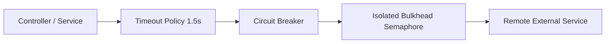

# Application Resilience & Fault Tolerance

## 1. In-Process Defense Topologies

---

## 2. In-Process Fault Patterns

- **Timeouts**: Wrap every external call in a hard timeout. A missing timeout can lock a thread pool indefinitely.
- **Bulkheads**: Limit concurrent calls to fragile third-party integrations (e.g., maximum 20 concurrent connections) so a third-party slowdown cannot exhaust application thread pools.
- **Fallbacks**: Provide degraded responses (e.g., cached or default data) when circuits open.
