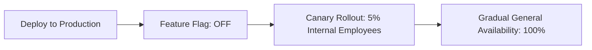

# Feature Flag Architecture

## 1. Decoupling Deployment from Release

## 2. Types of Flags
- **Release Toggles**: Temporary flags to hide in-progress features (TTL: 2 weeks).
- **Experimentation Toggles**: A/B testing variations for statistical evaluation.
- **Ops Toggles**: Kill-switches to disable expensive features during high load.
