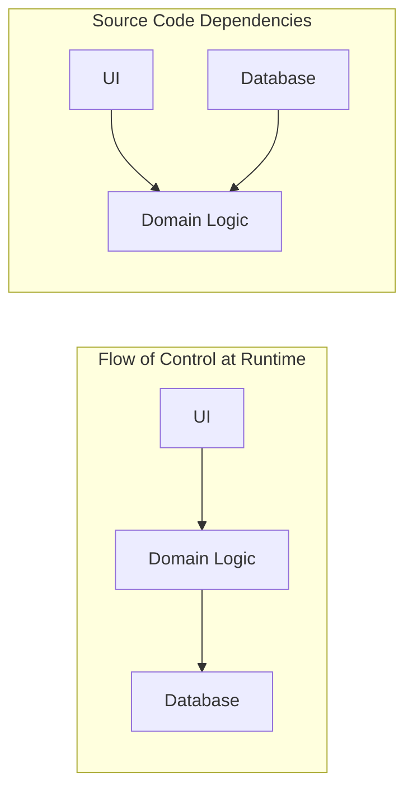

# Dependency Direction & Flow of Control

## 1. Flow of Control vs Dependency Direction

In procedural programming, the flow of control and source code dependencies point in the exact same direction:

```
Procedural (Coupled):
[ UI Controller ] ──(calls & depends on)──► [ Domain Logic ] ──(calls & depends on)──► [ Database Access ]
```
If the database schema changes, the domain logic and UI must be updated and recompiled.

In inverted enterprise architecture:


By placing an interface in the Domain layer, the flow of control points toward the database, but the **source code dependency points inward** toward the domain.
