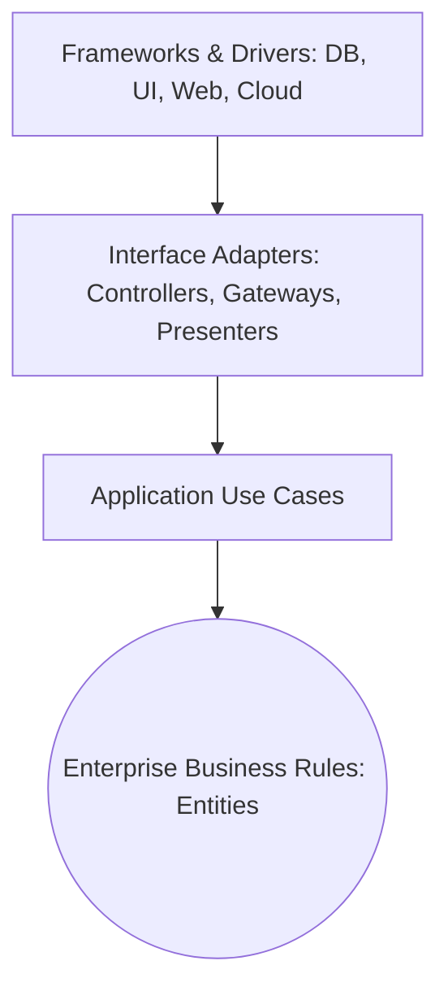

# The Clean Dependency Rule

## 1. The Concentric Ring Invariant

> **Nothing in an inner circle can know anything at all about something in an outer circle.**

### What This Means in Practice:
- Entities cannot mention controllers, DTOs, or database schemas.
- Use cases cannot import ORMs or HTTP frameworks.
- Data formats used in outer circles (e.g., JSON HTTP request bodies or database table rows) must never be passed into inner circles unchanged.
