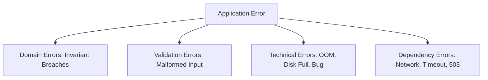

# Application Error Taxonomy

---

## 1. Classification Matrix
- **Domain Errors**: Expected business outcomes (e.g., `InsufficientFundsException`). Handled gracefully via business logic.
- **Validation Errors**: Client sent invalid data (e.g., negative price). Return HTTP 400/422 immediately.
- **Technical Errors**: Unhandled bugs or runtime failures. Return generic HTTP 500; log stack traces privately.
- **Dependency Errors**: Downstream service timed out or returned 5xx. Trigger circuit breaker or fallback.
