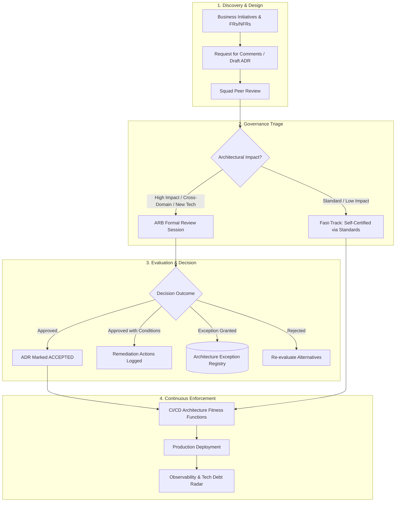

# Architecture Governance: Operating Models, Fitness Functions, and Decision Rights

## 1. Architectural Overview & Philosophy
**Architecture Governance** is the structured framework of decision rights, policies, automated controls, and review processes that ensure technical solutions align with strategic business goals, security mandates, and architectural principles.

Effective governance does **not** equal slow, bureaucratic approval committees. Modern architecture governance adheres to a foundational tenet:

> **Automate what can be measured; streamline what requires judgment; eliminate what merely generates ceremony.**

```
Traditional Bureaucratic Gatekeeper              Modern Automated Architecture Platform
┌─────────────────────────────────┐              ┌─────────────────────────────────┐
│ Manual 40-page Word spec review │              │ Shift-left Fitness Functions    │
│ Bi-weekly ARB meeting backlog   │  ──Transform─► Architecture Decision Records    │
│ Rubber-stamp compliance         │              │ Fast-track peer reviews         │
│ Architecture detached from code │              │ Continuous code-level telemetry │
└─────────────────────────────────┘              └─────────────────────────────────┘
```

---

## 2. Architecture Governance Operating Model



---

## 3. Decision Rights Matrix (RACI)

Clear decision rights prevent paralysis. The matrix below defines ownership across engineering roles:

| Decision Scope | Squad Tech Lead | Domain / Solution Architect | Enterprise Architect | ARB (Architecture Review Board) | InfoSec / CISO |
|---|---|---|---|---|---|
| **Internal Service Design & Micro-Patterns** | **A / R** | C | I | I | I |
| **Inter-Service Contracts & Protocol Selection** | R | **A** | C | I | C |
| **New Programming Language or Framework** | C | R | C | **A** | C |
| **Core Database / Storage Technology Selection**| C | R | C | **A** | C |
| **Cloud Service Selection & Landing Zone Mutation**| C | R | C | **A** | **A** |
| **Security Trust Boundary / Authentication Paradigm** | C | R | C | C | **A** |
| **Permanent Architecture Exception (>90 days)** | I | C | R | **A** | **A** |

*Key: **R** = Responsible, **A** = Accountable, **C** = Consulted, **I** = Informed.*

---

## 4. Architecture Fitness Functions (Automated Governance)

Rather than manually inspecting pull requests for architecture compliance, architects define **Architecture Fitness Functions** that execute in the automated build pipeline:

### Example: Architectural Boundary Enforcement (Java / ArchUnit)
```java
@AnalyzeClasses(packages = "com.enterprise.order")
public class ArchitectureRulesTest {

    @ArchTest
    public static final ArchRule domain_should_not_depend_on_infrastructure =
        noClasses().that().resideInAPackage("..domain..")
            .should().dependOnClassesThat().resideInAPackage("..infrastructure..");

    @ArchTest
    public static final ArchRule controllers_must_not_access_repositories_directly =
        noClasses().that().resideInAPackage("..controller..")
            .should().dependOnClassesThat().resideInAPackage("..repository..");
}
```

### Example: Contract Linting (OpenAPI / Spectral)
In CI/CD, every API contract must pass automated schema rules before merge:
```yaml
# .spectral.yaml
extends: ["spectral:oas"]
rules:
  must-have-traceparent-header:
    description: "Every endpoint must accept W3C traceparent correlation header"
    given: "$.paths.*.*.parameters[?(@.in == 'header' && @.name == 'traceparent')]"
    then:
      field: "@"
      function: defined
    severity: error
```

---

## 5. Architecture Exception & Technical Debt Management

Not all systems can achieve target architecture immediately. Unmanaged exceptions become toxic debt; managed exceptions provide visibility.

### 5.1. Architecture Exception Lifecycle
1. **Application**: Squad submits an Exception Request specifying the exact deviation, business justification, and compensating security/reliability controls.
2. **Time-Boxed Approval**: ARB grants exceptions for a strict duration (maximum **90 days** for non-critical, **30 days** for security-adjacent).
3. **Sunset Plan**: Every approved exception must be backed by a prioritized Jira ticket on the team backlog scheduled for debt retirement.

### 5.2. Technical Debt Categorization (The Debt Quadrant)
* **Prudent & Deliberate**: "We must ship by Friday to secure the enterprise client; we will defer multi-region replication and schedule it for Sprint 4." *(Legitimate architectural loan)*.
* **Reckless & Inadvertent**: "We had no idea our direct database queries between services would cause split-brain locks." *(Governance failure to be eliminated)*.

---

## 6. Common Architecture Governance Anti-Patterns

| Anti-Pattern | Manifestation | Remedy |
|---|---|---|
| **Ivory Tower Architecture** | Architects produce elaborate PDFs disconnected from delivery squads | Embed architects directly into sprint planning; mandate hands-on coding and fitness function authoring. |
| **The Rubber-Stamp ARB** | ARB meets weekly but approves 100% of proposals in 5 minutes | Triage out routine designs; focus ARB time exclusively on cross-cutting, high-risk, or irreversible one-way-door decisions. |
| **Architectural Drift** | System as documented diverges completely from system as deployed | Replace static design documents with code-derived architecture models and automated CI/CD fitness functions. |
| **Endless Deliberation** | Decisions stall for months waiting for 100% consensus | Establish single accountable decision makers (ADR Owners) with time-boxed escalation to the Principal/Chief Architect. |

---

## 7. Related Modules
* [16-architecture-deliverables/](../../16-architecture-deliverables/) — Architecture Decision Records (ADRs), System Architecture Documents (SAD), and review templates.
* [23-enterprise-architecture/](../../23-enterprise-architecture/) — Strategic capability mapping, portfolio roadmaps, and TOGAF/Zachman alignment.
* [24-architect-mastery/](../../24-architect-mastery/) — Technical leadership, stakeholder influence, and executive communication.
