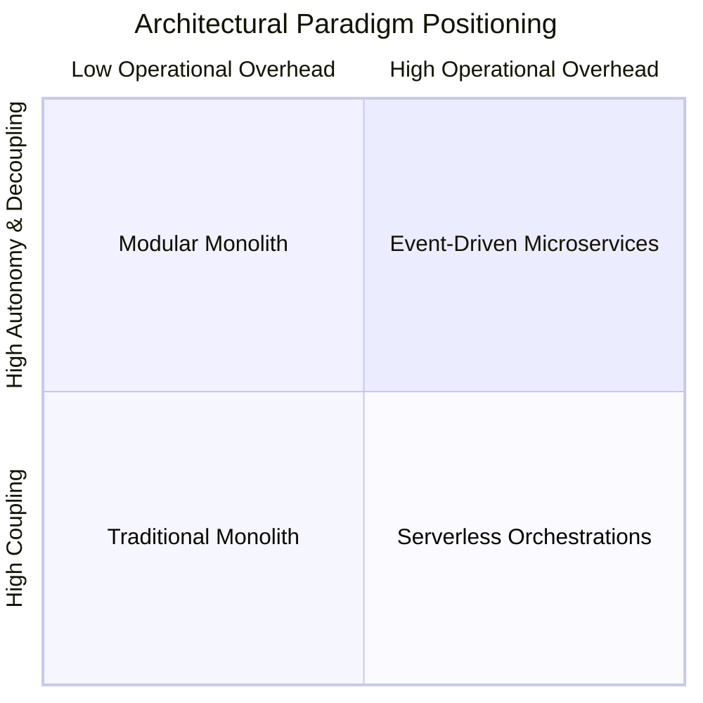

# Master Architecture Trade-Offs Framework

## Overview

Software architecture is fundamentally the management of trade-offs. No architectural pattern exists in a vacuum, and no pattern is universally superior. Every structural pattern solves specific business or engineering problems while introducing new operational complexities, cognitive friction, or financial overhead.

This framework provides Solution and Enterprise Architects with an authoritative, cross-pattern comparative evaluation to guide architectural selection for enterprise initiatives.

---

## The Master Pattern Comparison Matrix

| Pattern | Primary Strength | Primary Weakness | Organizational Fit | Operational Complexity | Cost Profile |
|:---|:---|:---|:---|:---:|:---:|
| **Monolithic** | Simplicity; instant local development; zero network latency | Deployment bottlenecks; shared blast radius; scaling limits | 1 small team (< 10 devs) | **Very Low** | **$** |
| **Modular Monolith** | Clean boundaries; ACID consistency; single deployable artifact | Requires strict discipline; cannot scale individual modules | 1–3 teams (10–30 devs) | **Low** | **$** |
| **Microservices** | Independent scaling; autonomous teams; fault isolation | Network latency; distributed transactions; operational overhead | Multiple teams (50+ devs) | **Very High** | **$$$$** |
| **Event-Driven (EDA)** | Extreme temporal decoupling; high write throughput; auditability | Eventual consistency; distributed debugging; schema drift | Medium-to-large enterprises | **High** | **$$$** |
| **Serverless (FaaS)** | Zero idle cost; instant elasticity; zero server maintenance | Cold start latency; vendor lock-in; execution time limits | Bursty / Event-driven workloads| Variable (**$ to $$$$**) |
| **CQRS** | Read performance optimization; flexible denormalized views | Dual-model complexity; eventual consistency lag | High read/write asymmetry | **Medium-High** | **$$$** |
| **Event Sourcing** | Complete immutable audit trail; temporal time travel queries | Schema evolution complexity; steep learning curve; GDPR erasure | Ledgers, banking, trading | **Very High** | **$$$** |
| **Hexagonal (Ports)** | Framework independence; extreme unit testability; longevity | Interface boilerplate; higher initial code volume | Long-term enterprise core apps | **Low-Medium** | **$$** |

---

## Cross-Pattern Attribute Radar Analysis

---

## Core Decision Dilemmas & Resolution Heuristics

### Dilemma 1: Modular Monolith vs. Microservices
- **Rule of Thumb**: Default to **Modular Monolith**.
- **When to pivot to Microservices**:
  1. The team exceeds 30–50 engineers and deployment release collisions are delaying product launches.
  2. A specific bounded context requires radically distinct hardware profiles (e.g., GPU compute vs. I/O-bound proxying).
  3. Strict regulatory compliance requires isolating sensitive payment data in a physically quarantined VPC enclave (PCI DSS).

### Dilemma 2: Synchronous REST/gRPC vs. Asynchronous EDA
- **Rule of Thumb**: Use **Synchronous (REST/gRPC)** for queries and client-facing interactions where the user requires immediate feedback (e.g., authentication, fetching user profile).
- **When to pivot to Asynchronous EDA**: For all state-mutating background workflows, multi-service fanouts, batch processing, and cross-bounded-context notifications.

### Dilemma 3: Traditional CRUD vs. Event Sourcing
- **Rule of Thumb**: Default to **Traditional CRUD (with audit log tables)**.
- **When to pivot to Event Sourcing**: When the business explicitly requires legal auditability (every penny accounted for), time-travel historical state reconstruction, or where the "journey of state changes" is as valuable as the current state itself (financial ledgers, insurance claims, medical dosage history).

---

## The 5 Laws of Architectural Trade-Offs

1. **Law of Conservation of Complexity**: You cannot destroy complexity; you can only move it. Moving from a monolith to microservices does not eliminate complexity—it merely shifts it from the application codebase into the networking and infrastructure layer.
2. **Law of Conway's Inevitability**: If your software architecture does not mirror your team's communication structure, either the architecture will decay or the organizational structure will be forced to change.
3. **Law of the Distributed Fallacy**: Calling a remote network service is never the same as calling an in-memory function. Networks introduce latency, packet loss, timeouts, duplicate payloads, and partial failure.
4. **Law of Reversibility (Two-Way Doors)**: Make easily reversible architectural decisions (e.g., choice of library) quickly; defer irreversible architectural decisions (e.g., choice of core database or tenancy model) until maximum empirical data is gathered.
5. **Law of Pragmatism**: The goal of enterprise architecture is to deliver sustainable business value, not to win theoretical purity awards. An operable modular monolith that ships features is infinitely superior to a broken microservices architecture that never leaves staging.
