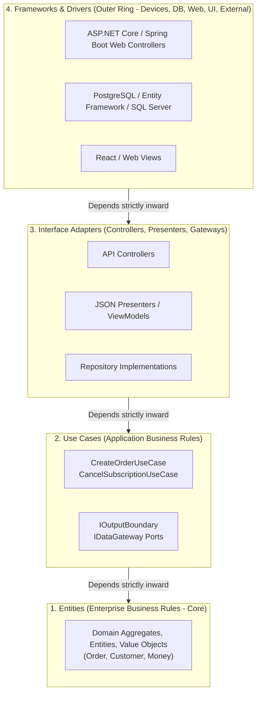

# Clean Architecture (The Onion Model)

## Overview
**Clean Architecture** (formulated by Robert C. Martin / "Uncle Bob" in 2012, synthesizing Hexagonal Architecture, Onion Architecture by Jeffrey Palermo, and Screaming Architecture) organizes a software system into concentric circular layers governed by a single immutable rule: **The Dependency Rule**.

## Problem It Solves
Prevents business rules from becoming obsolete or compromised by UI frameworks, databases, network libraries, or delivery mechanisms, ensuring that software systems remain maintainable, testable, and agile over multi-decade enterprise lifecycles.

## Context
The gold-standard architectural pattern for modern enterprise object-oriented and functional systems, domain-driven microservices, and modular monolithic services.

## Structure
Concentric circles: Entities (Center) $\to$ Use Cases $\to$ Interface Adapters $\to$ Frameworks & Drivers (Outer Ring).

## Diagram

## Components
1. **Entities (Center)**: Encapsulate enterprise-wide critical business rules and data structures. Zero knowledge of use cases, databases, or web frameworks.
2. **Use Cases (Application Business Rules)**: Orchestrate the flow of data to and from the entities. Direct the entities to use their critical business rules to achieve the goals of the use case.
3. **Interface Adapters**: Convert data from the format most convenient for the use cases and entities into the format most convenient for external agencies (database, web, UI).
4. **Frameworks & Drivers (Outer Ring)**: The glue code and tools: the database, the web framework, the message broker. **Where details live.**

## Communication Model
**The Dependency Rule**: Source code dependencies must point **strictly inward**, toward higher-level policies. Nothing in an inner circle can know anything at all about something in an outer circle (no class names, functions, variables, or data formats from outer circles may be mentioned in inner circles).

## Data Strategy
Data crossing boundaries consists of simple, isolated Data Transfer Objects (DTOs) or basic structs. Inner circles must never accept or return database rows or ORM-tracked entities directly.

## Benefits
* **Independent of Frameworks**: Frameworks are treated as replaceable details. If your framework dies or goes proprietary, your business logic is unaffected.
* **Independent of Database**: Can switch from SQL Server to PostgreSQL or DynamoDB without altering a single use case.
* **Independent of UI**: The Web UI can be completely rewritten in a modern JavaScript framework or replaced with a console CLI without touching business logic.
* **Extreme Testability**: Business rules can be validated with thousands of lightning-fast unit tests with zero database connections, web servers, or external services running.

## Disadvantages
* **Layer Proliferation & Boilerplate**: Requires creating distinct entity models, use case request/response models, and outer presentation DTOs, requiring extensive object mapping.
* **Overkill for Simple CRUD**: Applying Clean Architecture to an application that merely reads and writes rows to a single database table introduces unnecessary ceremony and mental friction.

## When to Use
* Enterprise applications with complex, long-lived business rules that must survive multiple technology shifts.
* Core domain services in Domain-Driven Design (DDD).
* Applications where fast, automated unit testing is a non-negotiable CI/CD gate.

## When NOT to Use
* Simple administrative CRUD portals and internal micro-utilities.
* Early-stage proof-of-concepts where time-to-market outweighs long-term maintainability.

## Scalability
* High horizontal scalability. Use cases and entities are purely in-memory and stateless.

## Reliability
* Exceptional. Invariant rules and business logic are guaranteed by compile-time boundaries and fast automated tests.

## Security
* Zero trust internally: Input validation occurs in the outer ring; core business invariants are re-validated inside Entities.

## Observability
* Easily monitored by wrapping use case interactors with logging and tracing decorators.

## Operational Complexity
* Low to moderate. Deployed as a standard single-process service.

## Cost
* Low cloud infrastructure cost; high initial development investment in architectural boilerplate.

## Migration Considerations
* Can be implemented incrementally by refactoring use cases one by one using Dependency Inversion.

## Trade-offs
* **Gains**: Ultimate testability, absolute technology independence, pristine domain model.
* **Sacrifices**: High mapping boilerplate, initial development ceremony.

## Related Patterns
* [Hexagonal Architecture](hexagonal.md)
* [Modular Monolith](modular-monolith.md)
* [Domain-Driven Design](../../13-architecture-patterns/domain-driven-design/)
