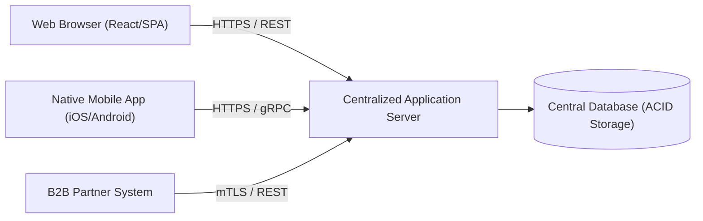

# Client-Server Architecture

## Overview
The **Client-Server Architecture** partitions system tasks and workloads between the providers of a resource or service (servers) and service requesters (clients). Clients initiate communication sessions with servers, which await incoming requests.

## Problem It Solves
Allows centralized resource management, data persistence, and security policy enforcement on server infrastructure while distributing user presentation and interface interaction across heterogeneous client devices.

## Context
Foundational paradigm for web applications, mobile platforms, desktop enterprise ERP clients (e.g., SAP GUI), and distributed database query engines.

## Structure
Two-tier or three-tier model: Thin/Thick Client $\to$ Application/Web Server $\to$ Database Server.

## Diagram

## Components
* **Client Tier**: Manages user input, view rendering, client-side validation, and local UI state.
* **Server Tier**: Enforces business logic, authentication, authorization, rate limiting, and coordinates data access.
* **Network Transport**: IP-based communication protocols (HTTP/HTTPS, WebSockets, gRPC).

## Communication Model
Predominantly synchronous Request-Reply over network sockets. Clients poll or establish long-lived connections (WebSockets/SSE) for real-time bidirectional updates.

## Data Strategy
State is centralized on the server tier to maintain a single source of truth. Clients cache read-only data locally with explicit expiration policies.

## Benefits
* Centralized security, auditing, and business rule enforcement.
* Clients can be updated, diversified, or replaced without modifying core backend data structures.
* Easier backup and disaster recovery management on centralized servers.

## Disadvantages
* Server tier represents a single point of failure (SPOF) if not clustered behind load balancers.
* Network dependency: Clients become inoperable or severely degraded during network dropouts unless engineered for offline-first operation.
* Server bandwidth and compute contention under concurrent client spikes.

## When to Use
* Standard distributed applications serving multi-platform user bases (Web, iOS, Android).
* Enterprise systems requiring centralized data governance and strict security oversight.

## When NOT to Use
* Peer-to-peer (P2P) systems where centralized servers introduce unacceptable single points of failure or censorship risks.
* High-frequency real-time edge processing where round-trip network latency to a central server is prohibitive.

## Scalability
* Servers scale horizontally behind Layer 4/7 load balancers. Stateless server design allows dynamic addition of server nodes.

## Reliability
* High availability achieved via active-passive or active-active server clustering and multi-AZ database replication.

## Security
* Strong perimeter security: TLS encryption in transit; OAuth2/OIDC token validation at server ingress.

## Observability
* Monitored via API gateway metrics, server-side APM (Application Performance Monitoring), and client-side error reporting (Sentry).

## Operational Complexity
* Low to moderate. Clear separation between client release cycles (App Store approvals) and server deployments.

## Cost
* Moderate. Cloud server sizing scales directly with concurrent active client connections.

## Migration Considerations
* Easy to evolve from a simple 2-tier client-server model into a 3-tier model or microservices by inserting an API Gateway between clients and backend services.

## Trade-offs
* **Gains**: Centralized data governance, multi-client support, and security perimeter control.
* **Sacrifices**: Dependent on network availability; latency overhead on every user interaction.

## Related Patterns
* [Layered Architecture](layered-architecture.md)
* [Monolithic Architecture](monolithic.md)
* [Microservices](microservices.md)
