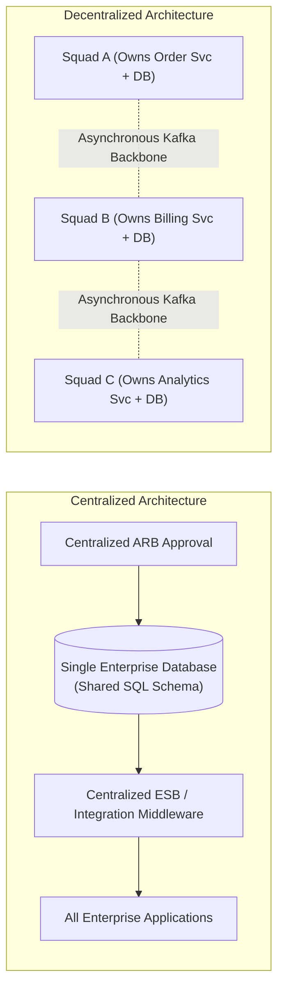

# Centralized vs. Decentralized Architecture: Governance & Topology

> **Domain**: `01-architecture/architecture-styles/comparisons`  
> **Status**: Approved  
> **Target Audience**: Enterprise Architects, Chief Architects, Technical Directors

---

## 1. Context & The Pendulum of Control

Enterprise IT continuously swings between two extremes:
* **Centralization**: Unified control, single enterprise databases, shared services, centralized Architecture Review Boards (ARB), and standardized technology stacks.
* **Decentralization**: Autonomous squads, microservices, polyglot databases, distributed event fabrics, and decentralized decision-making.

Understanding where an architecture sits on this spectrum is critical for balancing **Operational Efficiency** against **Organizational Agility**.

---

## 2. Multi-Dimensional Comparison



| Architectural Vector | Centralized Model | Decentralized Model |
| :--- | :--- | :--- |
| **Data Governance** | **Single Source of Truth**: Centralized master database; global consistency. | **Polyglot & Eventual**: Domain data ownership; Anti-Corruption Layers. |
| **Decision Authority**| Architecture Review Board (ARB) approves all designs and tech choices. | Autonomous squads decide within defined **Guardrails & Paved Paths**. |
| **Technology Footprint**| Homogeneous: Single language (.NET or Java), single database (Oracle). | Heterogeneous / Polyglot: Squads pick tools suited to their specific domain. |
| **Failure Modes** | **Single Point of Failure**: Central ESB or core DB outage halts entire business. | **Isolated Blast Radius**: Failures contained within bounded contexts. |
| **Team Velocity** | Slow: Squads blocked waiting for central database DBA approvals. | Fast: Squads iterate, test, and deploy independently. |
| **Total Cost** | Predictable, bulk enterprise licensing discounts; lower tooling fragmentation. | Variable; cloud sprawl, redundant tooling licenses, cross-team duplication. |

---

## 3. The Modern Enterprise Synthesis: "Federated Architecture"

Leading Fortune 500 enterprises avoid the failure modes of both extremes by adopting a **Federated Governance Model** (Spotify Model / Team Topologies / Data Mesh):

```text
┌─────────────────────────────────────────────────────────────┐
│                 FEDERATED ARCHITECTURE MODEL                │
├─────────────────────────────────────────────────────────────┤
│ 1. Centralized Platform Engineering (Paved Roads):          │
│    - Central team provides automated CI/CD pipelines.       │
│    - Central team provides hardened Kubernetes clusters,    │
│      mTLS service mesh, and OpenTelemetry monitoring.       │
│    - Central team enforces Zero Trust security guardrails.  │
├─────────────────────────────────────────────────────────────┤
│ 2. Decentralized Domain Execution (Squad Freedom):          │
│    - Business squads own their domain logic and schemas.    │
│    - Squads deploy to production at their own pace.         │
│    - Squads make Type 2 decisions autonomously without ARB. │
└─────────────────────────────────────────────────────────────┘
```

### The Architectural Heuristic
* **Centralize Infrastructure & Guardrails**: Security, identity, compliance, network plumbing, and FinOps policies must be centralized.
* **Decentralize Domain Business Logic**: Application code, domain models, and sprint feature releases must be decentralized.
