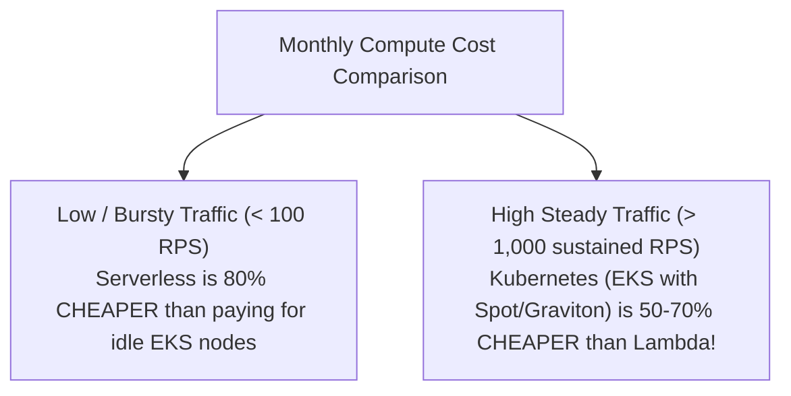

# Microservices vs. Serverless: Decision Guide

> **Domain**: `01-architecture/architecture-styles/comparisons`  
> **Status**: Approved  
> **Target Audience**: Solution Architects, Cloud Architects, Engineering Leads

---

## 1. Context & The Spectrum of Granularity

Both **Microservices (Container-based)** and **Serverless (FaaS-based)** aim to deliver loosely coupled, independently scalable systems. The core architectural difference lies in the **unit of deployment and runtime lifecycle**:
* In Container Microservices: The unit of deployment is a **Long-Running Container** managed by Kubernetes (EKS/AKS).
* In Serverless FaaS: The unit of deployment is an **Ephemeral Function** executed on-demand in response to events.

---

## 2. Comprehensive Comparison Matrix

| Architectural Vector | Container Microservices (Kubernetes) | Serverless FaaS (AWS Lambda / Azure Functions) |
| :--- | :--- | :--- |
| **Runtime Model** | Long-running daemon listening on a network port | Ephemeral micro-VM; boots on event, shuts down when idle |
| **Cold Starts** | **Zero**: Pods are pre-warmed and always running | **Present**: 50ms – 2,000ms latency spike on cold invocations |
| **Scaling Dynamics** | Moderate: Autoscaler adds pods/nodes in 1–3 minutes | **Instant**: Scales from 0 to 1,000 instances in seconds |
| **Execution Duration** | Unbounded: Can run 24/7 for days | **Hard Cap**: Terminates after 15 minutes (AWS Lambda) |
| **Protocol Support** | Any TCP/UDP protocol, WebSockets, gRPC streaming | Primarily HTTP, EventBridge, SQS, S3 event triggers |
| **Pricing Economics** | Pay for provisioned VM capacity (even if 0% utilized) | **Pay-per-execution**: $0.00 when traffic is zero |
| **Local Developer DX** | Run containers via Docker Compose / Minikube | Complex local simulation; relies on cloud testing sandboxes |
| **Infrastructure Toil**| High: Must manage node pools, CNI, ingress, patches | **Zero**: Cloud provider manages all underlying infrastructure |

---

## 3. The Workload Economic Crossover (FinOps Curve)

* **The Serverless Advantage**: For workloads that sit idle at night or experience random spikes (e.g., webhook processing, nightly reports, image resizing), Serverless is dramatically cheaper.
* **The Container Advantage**: For sustained, 24/7 high-volume APIs (e.g., 5,000 RPS sustained checkout traffic), paying per millisecond of Lambda execution becomes a massive financial penalty compared to running packed Kubernetes containers.

---

## 4. The Decision Heuristic

### Choose Container Microservices (EKS / AKS) IF:
* You have sustained, predictable 24/7 high traffic (> 500 RPS).
* You require long-lived bidirectional streaming connections (WebSockets, gRPC streaming).
* You require guaranteed sub-10ms p99 latency without cold start jitter.

### Choose Serverless FaaS (AWS Lambda) IF:
* Traffic is spiky, bursty, or unpredictable (scales to zero).
* The service is strictly event-driven (reacting to S3 uploads, SQS messages, DynamoDB streams).
* You are a small team without dedicated Kubernetes SRE operations capacity.
