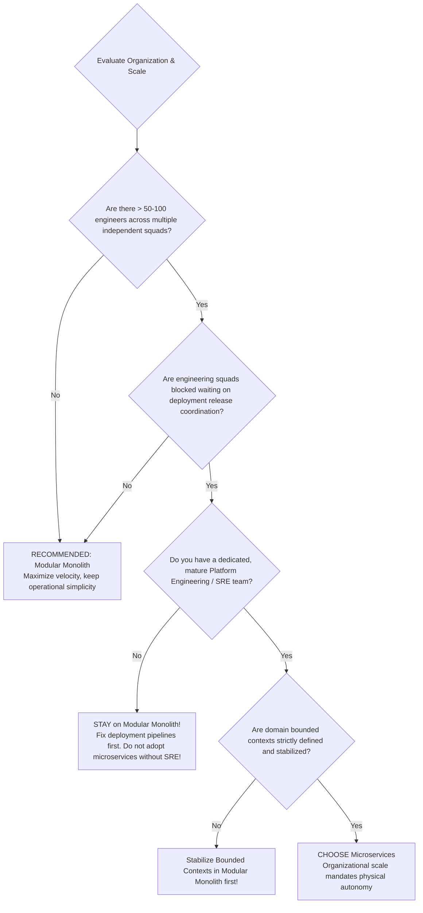

# Modular Monolith vs. Microservices: The Ultimate Decision Guide

> **Domain**: `01-architecture/architecture-styles/comparisons`  
> **Status**: Approved  
> **Target Audience**: Solution Architects, Enterprise Architects, Principal Engineers, CTOs

---

## 1. Problem Statement & The Industry Pendulum

Between 2014 and 2020, the software industry suffered from an aggressive hype cycle: organizations blindly broke down working monoliths into dozens of microservices, only to discover they had traded manageable in-process complexity for a fragile, unmaintainable **"Distributed Monolith"** with higher latency, frequent outages, and soaring cloud bills.

The architectural choice between a **Modular Monolith** and **Microservices** is not a technical badge of honor; it is an organizational and operational trade-off governed by Conway's Law.

---

## 2. Structural Comparison

```mermaid
flowchart TD
    subgraph ModularMonolith ["Option A: Modular Monolith (Logical Separation)"]
        MM_Host["Single Host Process (Shared JVM / .NET CLR)"]
        MM_Host --> Mod1["Order Module"]
        MM_Host --> Mod2["Payment Module"]
        Mod1 -. In-Memory Method / Event (10 nanoseconds) .-> Mod2
        Mod1 --> DB1[("Shared DB Instance (Separate Schemas)")]
        Mod2 --> DB1
    end

    subgraph Microservices ["Option B: Microservices (Physical Separation)"]
        GW["API Gateway"]
        GW -->|Network Call (10-50 milliseconds)| Svc1["Order Service Pod"]
        Svc1 -->|Network RPC (mTLS)| Svc2["Payment Service Pod"]
        Svc1 --> DBS1[("Order DB")]
        Svc2 --> DBS2[("Payment DB")]
        Svc1 -. Kafka Async Event .-> Svc2
    end
```

---

## 3. The 10-Point Architectural Trade-off Rubric

| Decision Dimension | Modular Monolith | Microservices | Architectural Reality |
| :--- | :--- | :--- | :--- |
| **Inter-Service Latency** | **Nanoseconds** (In-memory pointer dereference) | **Milliseconds** (Network serialization, TLS, TCP RTT) | Monolith is **1,000x faster** on internal calls |
| **Data Consistency** | **Local ACID Transactions** across module schemas | **Eventual Consistency / Saga Pattern** | Microservices require complex compensating transactions |
| **Partial Failure Resiliency**| Low: Memory leak or crash terminates process | High: Individual service failure is isolated | Microservices offer superior blast radius containment |
| **Deployment Autonomy** | Coupled: All modules deploy together in one artifact | **Autonomous**: Squads deploy independently 20x daily | Microservices solve organizational team scale |
| **Operational Complexity** | Low: Single CI/CD, single container, single DB | **Extreme**: Kubernetes, service mesh, distributed tracing | Microservices mandate a dedicated Platform/SRE team |
| **Local Developer Setup** | Clone 1 repo, press F5; debug anywhere with breakpoints | Running 25 microservices locally requires 64GB RAM | Monolith provides vastly superior local DX |
| **Scaling Flexibility** | Scales host process as a whole | Fine-grained: Scale only the compute-heavy service | Microservices win for asymmetric hardware workloads |
| **Technology Freedom** | Single runtime ecosystem (.NET, Java, or Node) | Polyglot: Each service can use a different language | Polyglot is usually a liability, rarely an asset |
| **Cloud Infrastructure Cost**| Low: High CPU/RAM packing density on fewer VMs | High: Resource fragmentation, sidecar proxies, egress | Microservices increase cloud spend by 30%–100% |
| **Refactoring Boundaries** | Easy: IDE rename refactors cross-module interfaces | Brutal: Requires updating multi-repo API contracts | Monolith allows rapid domain model adjustments |

---

## 4. The Decision Framework: When to Choose Which?



---

## 5. Architectural Verdict & Summary

> **"Default to a Modular Monolith. Mature your domain bounded contexts in shared memory first. Sliced microservices out only when organizational friction or extreme asymmetric scaling forces your hand."**
