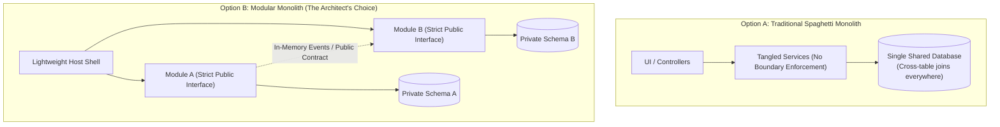

# Monolith vs. Modular Monolith: Decision Guide

> **Domain**: `01-architecture/architecture-styles/comparisons`  
> **Status**: Approved  
> **Target Audience**: Solution Architects, Principal Engineers, Engineering Directors

---

## 1. Problem Statement & Context

Many growing software systems begin as a traditional monolithic application. Over time, as features are added by multiple developers, the internal boundaries blur. Classes in the `Billing` package start directly referencing tables and internal private methods in the `Ordering` and `User` packages.

The codebase degenerates into a **"Big Ball of Mud"**:
* Any modification to one feature causes unexpected regressions in three unrelated modules.
* Compilation and automated test suites slow down dramatically.
* Engineering teams mistakenly believe the only solution is to throw away the monolith and rewrite the entire system as distributed microservices.

---

## 2. The Architectural Options

---

## 3. Deep-Dive Trade-off Analysis

| Decision Dimension | Traditional Monolith | Modular Monolith | Architectural Winner |
| :--- | :--- | :--- | :---: |
| **Cognitive Load** | Overwhelming; developers must hold the entire global codebase in their heads | Low; developers focus strictly within their bounded module | **Modular Monolith** |
| **Refactoring & Modularity**| High risk of unintended side-effects and circular dependencies | Boundaries enforced by package/project visibility and ArchUnit tests | **Modular Monolith** |
| **Database Coupling** | Direct cross-module SQL joins (`JOIN orders o ON o.customer_id = c.id`) | Modules communicate across boundaries via IDs and public APIs; zero cross-schema joins | **Modular Monolith** |
| **Deployment Complexity** | Single build and deploy pipeline | Single build and deploy pipeline | **Tie** |
| **Network Latency** | Nanoseconds (in-memory execution) | Nanoseconds (in-memory execution) | **Tie** |
| **Extraction to Microservices**| Extremely painful; requires months of unravelling tangled code | Trivial; module boundaries and contracts are already physically isolated | **Modular Monolith** |

---

## 4. The Decision: When to Choose Which?

### Choose a Traditional Monolith IF:
* The system is a disposable prototype, proof-of-concept, or early MVP built by a 2-person team to validate product-market fit within 6 weeks.
* The domain is trivially small (< 5 database tables, simple CRUD).

### Choose a Modular Monolith IF:
* The platform is intended to be a long-lived enterprise system with multiple distinct business domains.
* Multiple developers or squads work in the same repository.
* You want the clean boundary hygiene of microservices **without the brutal distributed systems tax**.

---

## 5. Migration Consequences & Next Steps

Transforming a traditional monolith into a modular monolith requires:
1. **Physical Project Partitioning**: Moving classes into separate compiler-isolated assemblies/packages.
2. **Eliminating Direct Database Joins**: Replacing cross-domain SQL joins with separate repository queries linked by foreign IDs.
3. **Automated Fitness Functions**: Adding CI checks (ArchUnit / NetArchTest) that fail the build if Module A directly references internal classes of Module B.
