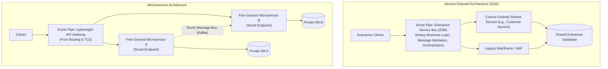

# SOA vs. Microservices: Architectural Evolution & Key Differences

> **Domain**: `01-architecture/architecture-styles/comparisons`  
> **Status**: Approved  
> **Target Audience**: Enterprise Architects, Solution Architects, Integration Architects

---

## 1. Context: The Ancestry of Distributed Services

Many engineers mistakenly believe that Microservices was a brand-new invention. In reality, **Microservices is the evolutionary successor to Service-Oriented Architecture (SOA)**, refined by lessons learned from the failures of heavyweight middleware, canonical data models, and centralized governance.

---

## 2. Structural & Philosophical Comparison

---

## 3. The 7 Core Architectural Differentiators

| Dimension | Service-Oriented Architecture (SOA) | Microservices Architecture |
| :--- | :--- | :--- |
| **Architecture Philosophy** | **Smart Pipes, Dumb Endpoints**: The ESB handles mediation, routing, transformation, and business flows. | **Smart Endpoints, Dumb Pipes**: Message brokers (Kafka) are pure append-only logs; logic lives in the services. |
| **Service Granularity** | **Coarse-Grained**: Broad, multi-capability enterprise services (`CustomerService`, `OrderService`). | **Fine-Grained**: Single Bounded Context; single business capability (`OrderFulfillmentService`). |
| **Data Storage** | **Shared Database**: Services share centralized relational databases and execute 2PC transactions. | **Database-per-Service**: Strictly private; cross-service data sharing strictly forbidden. |
| **Integration Protocols** | Heavy, formal: SOAP, WSDL, XML, WS-* standards. | Lightweight, polyglot: REST (JSON), gRPC (Protobuf), CloudEvents. |
| **Organizational Scope** | **Enterprise-Wide**: Reusable across an entire conglomerate or multi-subsidiary enterprise. | **Application / Product-Wide**: Scoped around a single digital product or business value stream. |
| **Governance Model** | Centralized Architecture Review Board and integration committee. | Decentralized; autonomous squads own their deployment and tech stack. |
| **Canonical Data Model** | Mandatory enterprise-wide shared data model (XSD). | Bounded Context Ubiquitous Language; Anti-Corruption Layers. |

---

## 4. Modern Enterprise Verdict

* **SOA is Not Dead**: In massive Fortune 500 enterprises, airlines, and banks, SOA/ESB patterns still reliably coordinate legacy core banking engines, SAP ERPs, and mainframe ledgers.
* **The Modern Hybrid Architecture**: Use SOA principles for coarse-grained **Enterprise Modernization** (mediating legacy enterprise systems) while using Microservices for **Customer-Facing Digital Innovation** (mobile apps, customer portals, rapid product delivery).
