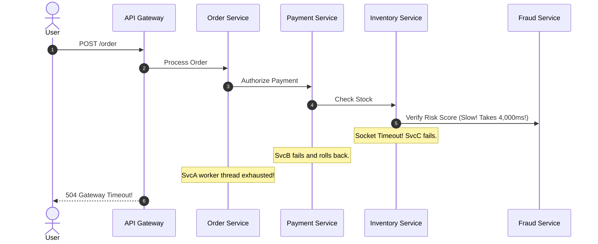
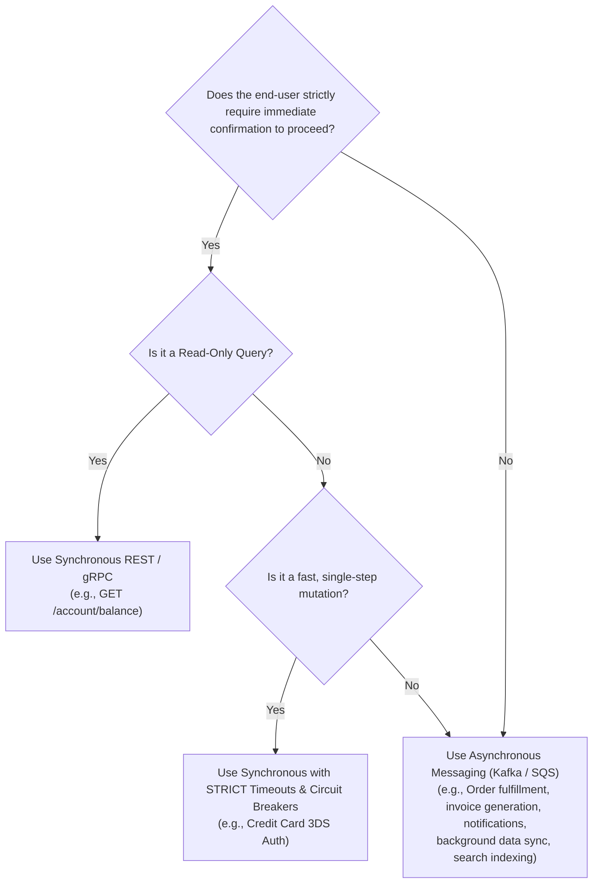

# Synchronous vs. Asynchronous Communication: Architectural Trade-offs

> **Domain**: `01-architecture/architecture-styles/comparisons`  
> **Status**: Approved  
> **Target Audience**: Solution Architects, Integration Architects, Principal Engineers

---

## 1. Context & The Communication Paradigm

At the core of all distributed systems lies the fundamental architectural choice of communication:
* **Synchronous (Request-Reply)**: The caller sends a request and **blocks/waits** until the callee finishes processing and returns an answer.
* **Asynchronous (Fire-and-Forget / Pub-Sub)**: The caller emits a message or event and **immediately proceeds** without waiting for the consumer to complete processing.

---

## 2. Architectural Comparison Matrix

| Decision Dimension | Synchronous (REST, gRPC) | Asynchronous (Kafka, RabbitMQ, SQS) |
| :--- | :--- | :--- |
| **Temporal Coupling** | **Tightly Coupled in Time**: Both caller and callee must be online and healthy simultaneously. | **Decoupled in Time**: Producer can publish while consumer is offline or recovering from a crash. |
| **Latency Profile** | Latency is additive: $\text{Total Latency} = \text{RTT}_1 + \text{RTT}_2 + \dots$ | Immediate: Producer returns in `< 5ms` as soon as message hits broker disk buffer. |
| **Cascading Failure Risk**| **High**: A slow downstream service blocks threads, causing thread pool starvation upstream. | **Zero**: Messages buffer safely in the queue; consumer processes at its own rate. |
| **Consistency Model** | Immediate Consistency: Client knows instantly if the operation succeeded. | **Eventual Consistency**: Client receives "202 Accepted"; actual processing completes later. |
| **Debugging Complexity** | Low: Standard stack traces and linear call stacks. | **High**: Requires W3C distributed trace correlation IDs; asynchronous call stacks do not exist. |
| **Dual-Write Vulnerability**| High: Prone to partial failure if calling multiple services sequentially. | Low: Solved cleanly via the Transactional Outbox Pattern. |

---

## 3. The Cascading Timeout Chain (The Synchronous Death Spiral)

---

## 4. The Architectural Decision Heuristic

### The Enterprise Golden Rule
> **"Synchronous for Queries; Asynchronous for Commands and Mutations."**  
> If an operation changes state and triggers multi-step downstream side-effects, return `202 Accepted` immediately and orchestrate downstream steps asynchronously via an event broker.
