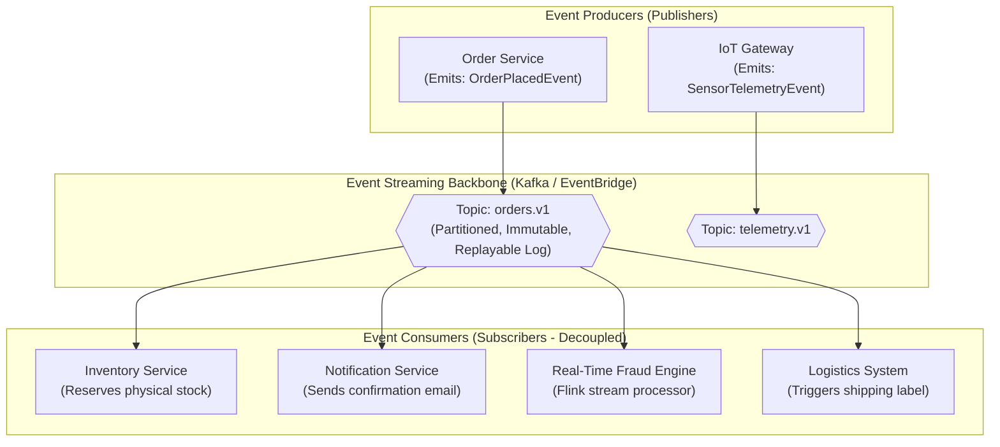

# Event-Driven Architecture (EDA)

## Overview
**Event-Driven Architecture (EDA)** is an asynchronous architectural style in which software components communicate by emitting, detecting, and reacting to state changes called **Events**, fully decoupling event producers from event consumers in time, space, and synchronization.

## Problem It Solves
Eliminates brittle, synchronous point-to-point HTTP chaining (`A -> B -> C -> D`), protects systems from cascading timeouts, enables extreme real-time horizontal scalability, and supports high-throughput event streaming.

## Context
Standard architecture for real-time analytics, IoT telemetry ingestion, modern e-commerce fulfillment, financial trading, and asynchronous microservices coordination.

## Structure
Producers $\to$ Event Ingestion / Broker Backbone $\to$ Consumers & Stream Processors.

## Diagram

## Components
* **Event Producer**: Detects a business mutation and emits an immutable record of fact (e.g., `OrderPlaced`).
* **Event Broker**: Persistent messaging fabric (Apache Kafka, RabbitMQ, AWS EventBridge, Azure Service Bus).
* **Event Consumer**: Independent service that subscribes to topics and reacts asynchronously to events.
* **Schema Registry**: Enforces contract backward and forward compatibility (Avro/JSON Schema/Protobuf).

## Communication Model
Strictly asynchronous Publish/Subscribe. Producers do not know, care, or wait for consumers to process events.

## Data Strategy
Decentralized data with **Eventual Consistency**. State can be modeled using **Event Sourcing** (retaining every state mutation as an append-only log) and projected into CQRS read-models.

## Benefits
* **Complete Decoupling**: Producers have zero knowledge of consumers. A new analytics or marketing service can be added to the enterprise without touching or deploying the core Order Service!
* **High Fault Resiliency & Buffering**: If the Notification Service crashes, the event remains safe in the Kafka broker log. When the service recovers 2 hours later, it resumes processing without losing a single message.
* **Replayability & Time Travel**: Brokers with log retention (Kafka) allow newly deployed services to replay months of historical events to build fresh materialized views.

## Disadvantages
* **Eventual Consistency Complexity**: User interface cannot assume immediate consistency (e.g., balance might take 200ms to reflect on the web dashboard).
* **Debugging & Distributed Tracing**: Tracing a workflow that hops across 5 message queues requires strict correlation ID propagation; asynchronous stack traces do not exist.
* **Duplicate Processing**: Distributed networks guarantee *at-least-once* delivery, requiring all consumers to be strictly **idempotent**.

## When to Use
* High-throughput, bursty systems (IoT, e-commerce, telemetry).
* Complex multi-step business workflows spanning multiple independent domains.
* Systems requiring real-time stream processing, complex event processing (CEP), or audit logging.

## When NOT to Use
* Simple synchronous request-response CRUD applications with low traffic.
* Operations that require immediate ACID confirmation before returning to the user.

## Scalability
* Extreme horizontal scalability. Topics partitioned across clustered nodes allow linear scaling up to millions of events per second.

## Reliability
* Very high. Message durability backed by multi-broker replication and disk persistence.

## Security
* Transport security via TLS; producer/consumer authentication via SASL/SCRAM or mTLS; fine-grained ACLs per topic.

## Observability
* Monitored via OpenTelemetry W3C trace context injected into Kafka message headers, consumer lag metrics, and dead letter queue (DLQ) alerts.

## Operational Complexity
* High. Managing Kafka clusters, partition rebalancing, schema registries, and consumer lag monitoring requires specialized engineering expertise.

## Cost
* Moderate to high depending on data retention periods, cross-AZ traffic, and managed broker fees.

## Migration Considerations
* Excellent integration pattern: Use Change Data Capture (Debezium) to convert legacy database updates into an event stream for modern systems.

## Trade-offs
* **Gains**: Maximum decoupled autonomy, high throughput, fault buffering, seamless extensibility.
* **Sacrifices**: Immediate consistency, trivial debugging, operational simplicity.

## Related Patterns
* [CQRS](../../13-architecture-patterns/cqrs/)
* [Event Sourcing](../../13-architecture-patterns/event-sourcing/)
* [Saga Pattern](../../13-architecture-patterns/saga/)
