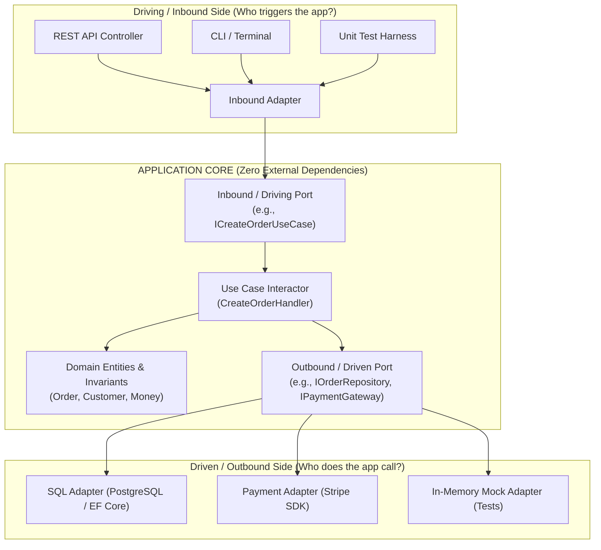

# Hexagonal Architecture (Ports and Adapters)

## Overview
**Hexagonal Architecture** (also known as the **Ports and Adapters Pattern**, created by Alistair Cockburn in 2005) structures an application such that its core business domain logic is completely isolated from external technologies, frameworks, UI interfaces, and databases, interacting with the outside world strictly through abstract **Ports** (interfaces) and concrete **Adapters** (technology implementations).

## Problem It Solves
Solves the fatal flaw of traditional layered architectures where business domain logic becomes inextricably entangled with database ORMs, HTTP web frameworks, and third-party vendor SDKs, making automated testing slow and technology swaps almost impossible.

## Context
Standard domain-first architecture for mission-critical enterprise backend services, Domain-Driven Design (DDD) aggregates, and long-lived enterprise core systems.

## Structure
Application Core (Domain Entities + Use Cases) $\to$ Inbound/Outbound Ports (Interfaces) $\to$ Inbound/Outbound Adapters (Technology Infrastructure).

## Diagram

## Components
* **Application Core**: The pure domain model (Entities, Value Objects, Domain Services) and Use Case Handlers. Has **zero imports or dependencies** on external libraries (no ASP.NET, no Spring, no Entity Framework, no AWS SDK).
* **Ports**: Invariant abstract interfaces owned by the Core.
  * *Inbound Ports*: Describe what the outside world can ask the application to do (`IOrderService`).
  * *Outbound Ports*: Describe what the application needs from the outside world (`IOrderRepository`, `INotificationGateway`).
* **Adapters**: Concrete technology implementations that sit outside the hexagon.
  * *Inbound Adapters*: Convert external HTTP/gRPC requests into domain commands (e.g., `OrderController`).
  * *Outbound Adapters*: Implement outbound ports using specific technologies (e.g., `PostgresOrderRepository` using SQL).

## Communication Model
* Inbound: External world invokes Inbound Adapters, which call Inbound Ports into the Core.
* Outbound: Core calls Outbound Ports; Dependency Inversion ensures concrete Outbound Adapters execute the call.

## Data Strategy
**Domain State is King**: Domain entities live purely in memory as domain objects. Persistence models are completely decoupled; the Outbound Adapter translates domain aggregates into database rows/tables and vice versa.

## Benefits
* **Complete Technology Independence**: Swap from PostgreSQL to MongoDB or from AWS SQS to Kafka by writing a new Adapter—**zero lines of core business domain logic change!**
* **Blazing Fast Automated Unit Testing**: The entire application core can be tested in milliseconds by injecting in-memory mock adapters; zero running databases or web servers required!
* **Decoupled from Framework Lifecycles**: Upgrading from Spring Boot 2 to 3 or .NET 6 to 8 only touches outer adapters; your core domain rules remain intact.

## Disadvantages
* **Mapping Boilerplate**: Requires mapping between HTTP DTOs, Domain Entities, and Database persistence entities (three distinct models for the same concept).
* **Higher Initial Cognitive Load**: Junior developers often struggle with Dependency Inversion and the proliferation of interfaces.

## When to Use
* Core domain systems with complex, long-lived business rules (banking, insurance, ERP).
* Applications practicing Domain-Driven Design (DDD).
* Systems that mandate 80%+ unit test coverage and fast CI pipelines.

## When NOT to Use
* Simple, low-complexity CRUD administrative dashboards (traditional Layered Architecture is faster).
* Disposable short-lived prototypes or quick hackathon MVPs.

## Scalability
* High horizontal scalability. Core is completely stateless; adapters manage connection pooling.

## Reliability
* Extreme reliability. Core logic is protected by exhaustive in-memory test suites.

## Security
* Security by design: Domain entities validate their own business invariants independently of user input; authentication happens strictly in outer inbound adapters.

## Observability
* Easily instrumented by wrapping ports with Decorator/Proxy adapters that record metrics and distributed traces without polluting domain code.

## Operational Complexity
* Low to moderate. Standard single-process deployment.

## Cost
* Highly cost-effective. Zero distributed systems overhead.

## Migration Considerations
* Can be applied inside a Monolith, a Modular Monolith, or within an individual Microservice.

## Trade-offs
* **Gains**: Ultimate testability, technology independence, architectural longevity, domain purity.
* **Sacrifices**: High mapping boilerplate, initial development ceremony.

## Related Patterns
* [Clean Architecture](clean-architecture.md)
* [Modular Monolith](modular-monolith.md)
* [Domain-Driven Design](../../13-architecture-patterns/domain-driven-design/)
