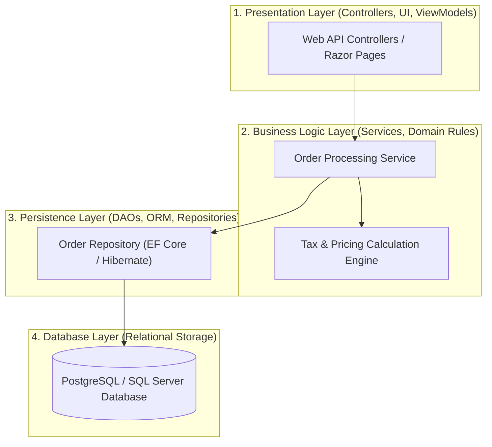

# Layered Architecture (N-Tier)

## Overview
The **Layered Architecture** (often referred to as N-Tier Architecture) organizes a software system into horizontal logical layers, where each layer possesses a distinct, cohesive responsibility and provides services strictly to the layer immediately above it.

## Problem It Solves
Prevents chaotic spaghetti code by separating user interface presentation, business domain workflows, data persistence mechanics, and database access into clearly isolated software boundaries.

## Context
Standard baseline architecture for enterprise line-of-business (LOB) web applications, internal administrative portals, and traditional departmental systems.

## Structure
Standard 4-layer topology: Presentation Layer $\to$ Business / Service Layer $\to$ Persistence Layer $\to$ Database Layer.

## Diagram

## Components
* **Presentation Tier**: Handles HTTP protocol serialization, model validation, status codes, user session authentication.
* **Business Service Tier**: Coordinates domain operations, executes business invariants, manages application transactions.
* **Persistence Tier**: Translates in-memory entity objects into relational database tables using ORMs or raw SQL queries.
* **Database Tier**: Physical storage engine executing disk I/O, relational indexing, and ACID transaction commits.

## Communication Model
Strictly synchronous, in-process function/method invocations. Calls flow downward from top to bottom.

## Data Strategy
Single centralized relational database (PostgreSQL, SQL Server, Oracle) shared across all layers. All transactions run inside local ACID database connections.

## Benefits
* High conceptual simplicity; well understood by junior to senior developers.
* Natural separation of concerns and clear code organization.
* Easy to test individual business services via mocked persistence interfaces.

## Disadvantages
* **Sinkhole Anti-Pattern**: Many requests simply pass through layers without executing any business logic (Controller simply calls Service, which simply calls Repository, which simply executes `SELECT *`).
* **Monolithic Database Bottleneck**: The single shared database becomes the ultimate scaling bottleneck.
* Tight coupling to the database schema often leaks database structures directly into presentation models.

## When to Use
* Standard enterprise internal business applications with low to moderate concurrency requirements (< 2,000 RPS).
* Teams with standard, homogeneous skill sets building straightforward CRUD applications.
* Greenfield systems where domain boundaries are not yet clearly understood.

## When NOT to Use
* High-scale distributed systems requiring independent horizontal scalability per business domain.
* Systems with complex, rapidly evolving business logic that must be decoupled from persistence mechanisms (prefer Hexagonal or Clean Architecture).

## Scalability
* Compute (Presentation & Business layers) scales horizontally by adding load-balanced application servers.
* Database layer scales vertically (Scale-Up) or via read replicas. Write scaling is bounded by the primary database node.

## Reliability
* High reliability due to lack of network hops between layers.
* Single point of failure (SPOF) at the centralized database instance.

## Security
* Perimeter security enforced at the Presentation layer via WAF and authentication filters.
* Database protected inside isolated private subnets; access restricted to application connection pools.

## Observability
* Trivial telemetry tracing; single-process execution allows stack traces to capture complete error context without distributed tracing.

## Operational Complexity
* Very low. Simple single-artifact deployment (Docker container, IIS website, or single JAR/WAR file).

## Cost
* Highly cost-efficient. Minimal cloud infrastructure spend; requires only basic compute VMs/containers and a managed database instance.

## Migration Considerations
* Excellent starting architecture. Can be evolved incrementally into a Modular Monolith or decomposed into Microservices via the Strangler Fig pattern once scaling limits are reached.

## Trade-offs
* **Gains**: Rapid time-to-market, minimal cognitive load, simple deployment, and zero distributed systems overhead.
* **Sacrifices**: Long-term agility under massive team growth; rigid horizontal scaling bounds.

## Related Patterns
* [Hexagonal Architecture](hexagonal.md)
* [Clean Architecture](clean-architecture.md)
* [Monolithic Architecture](monolithic.md)
