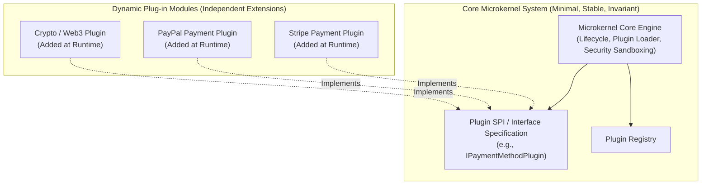

# Microkernel Architecture (Plugin Architecture)

## Overview
The **Microkernel Architecture** (commonly referred to as the **Plugin Architecture**) divides a system into a minimal **Core System** (the microkernel) containing only the bare minimum lifecycle logic necessary to operate, and dynamic, modular **Plugin Components** that supply domain-specific features, extensions, and custom business rules.

## Problem It Solves
Solves the problem of building extensible, customizable software products (e.g., IDEs, payment gateways supporting 50 payment methods, insurance engines with custom regional policies) where new capabilities must be added dynamically without modifying or destabilizing the core platform.

## Context
Standard architecture for desktop applications (VS Code, Eclipse, Obsidian), workflow automation engines, enterprise tax/insurance rule engines, and browsers (Chrome extensions).

## Structure
Core Microkernel System $\to$ Plugin Registry & Contract Interface $\to$ Dynamic Independent Plugins.

## Diagram

## Components
* **Core Microkernel**: Minimal engine managing plugin discovery, registration, lifecycle (load, start, stop, unload), and shared resources.
* **Plugin Interface (SPI)**: Strongly typed interface specification that all plugins must implement.
* **Plugin Registry**: Directory mapping plugin IDs to runtime instances.
* **Plug-in Components**: Autonomous code packages containing specialized logic.

## Communication Model
* **Point-to-Point In-Memory**: Core invokes plugin methods directly via interface contracts.
* **Event Hooks**: Core emits lifecycle events (e.g., `OnDocumentSaved`) that registered plugins listen and react to.

## Data Strategy
The Core manages foundational system state; plugins own private configuration and isolated metadata. Plugins must not touch internal core storage directly.

## Benefits
* **Extreme Extensibility**: Third-party developers or partner teams can extend system capabilities without access to core source code.
* **Feature Isolation**: Disabling or upgrading a single buggy plugin does not impact other plugins or crash the core engine.
* **Customizability**: Allows packaging distinct product tiers (e.g., Community Edition with 5 plugins vs. Enterprise Edition with 50 plugins).

## Disadvantages
* **Interface Rigidity**: The Plugin Interface is a Type 1 architectural decision. Changing the core plugin contract breaks all existing plugins across the ecosystem!
* **Security & Sandboxing**: Malicious or poorly written plugins can consume excessive CPU, leak memory, or execute unauthorized system calls unless strictly sandboxed.
* **Startup Performance**: Scanning and loading hundreds of plugins dynamically at startup can significantly degrade boot times.

## When to Use
* Packaged software products, developer tools, and workflow automation platforms.
* Systems requiring dynamic feature toggling and customized enterprise rule sets per client/region.

## When NOT to Use
* Highly interconnected, rapidly changing domain systems where boundaries between core and extensions are ambiguous.
* Systems where all features are known upfront and never require third-party customization.

## Scalability
* Scales vertically on single hosts; horizontally scaled by running multiple identical plugin-enabled host instances behind a load balancer.

## Reliability
* High reliability for the core; however, robust error handling must isolate exceptions thrown inside rogue plugins.

## Security
* Requires strict plugin sandboxing (e.g., WebAssembly / Wasm sandboxes, separate AppDomains, or Java Security Managers) to prevent plugins from compromising the host.

## Observability
* Core must instrument plugin execution timers to detect and flag slow or hanging plugins.

## Operational Complexity
* Moderate. Requires automated plugin versioning, registry distribution, and compatibility verification.

## Cost
* Low infrastructure cost. Maximizes modularity on single computing instances.

## Migration Considerations
* Excellent refactoring target for monoliths that have become bloated with dozens of client-specific custom hacks.

## Trade-offs
* **Gains**: Infinite extensibility, clean architectural boundary, isolated customization.
* **Sacrifices**: Rigid core contract lifecycle, plugin sandboxing complexity.

## Related Patterns
* [Hexagonal Architecture](hexagonal.md)
* [Modular Monolith](modular-monolith.md)
