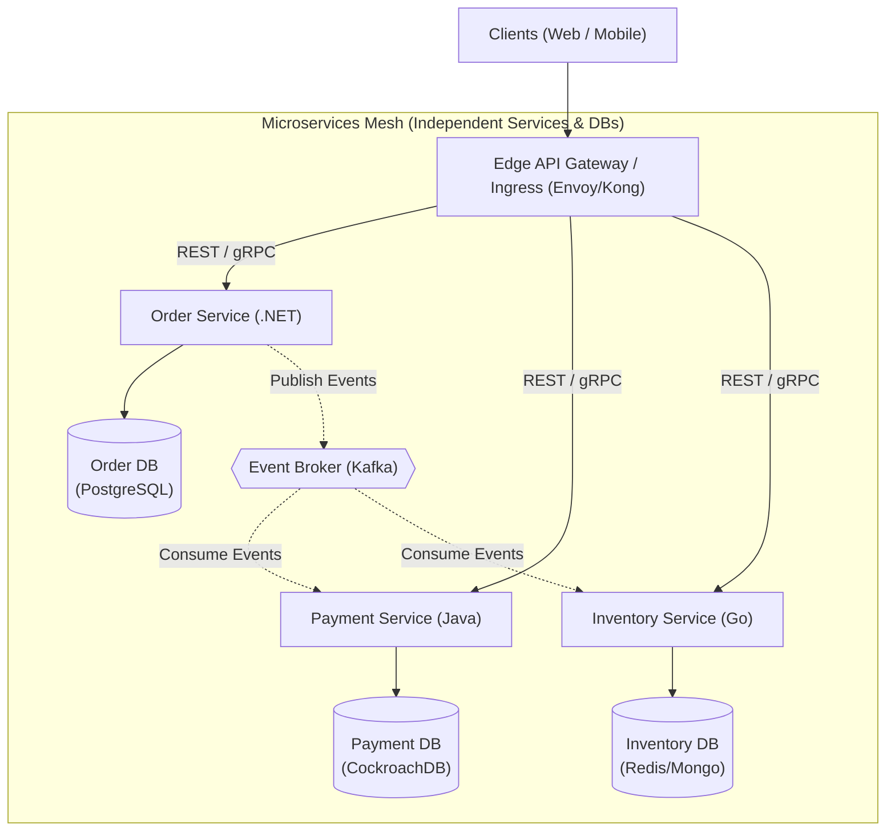

# Microservices Architecture

## Overview
A **Microservices Architecture** structures an application as a collection of small, autonomous, independently deployable, and loosely coupled services, each modeled around a specific business capability (Domain Bounded Context) and communicating over a network via lightweight protocols (HTTP/REST, gRPC, or message brokers).

## Problem It Solves
Solves organizational scaling bottlenecks in massive software organizations (Conway's Law) by allowing hundreds of autonomous engineering teams to develop, test, deploy, and scale their services independently without coordinating release schedules.

## Context
Standard enterprise architecture for large-scale digital platforms, global tech firms, and hyper-scale organizations with hundreds of engineers and diverse technology requirements.

## Structure
Physically distributed network of autonomous services, each possessing its own private data store and dedicated deployment pipeline.

## Diagram

## Components
* **API Gateway**: Single ingress entry point handling TLS termination, rate limiting, and route forwarding.
* **Microservices**: Autonomous containers owning specific domain business logic.
* **Database per Service**: Dedicated private persistence store per microservice.
* **Event Backbone**: High-throughput message broker (Kafka/RabbitMQ) coordinating asynchronous workflows.
* **Service Discovery & Mesh**: Manages dynamic service IP discovery, mTLS, and traffic shaping.

## Communication Model
* **Synchronous**: REST (HTTP/2) or gRPC for low-latency point-to-point queries.
* **Asynchronous**: Event-Driven pub/sub (Kafka/RabbitMQ) for inter-service mutations and business notifications.

## Data Strategy
**Database-per-Service**: Strictly enforced. Direct cross-service database access is forbidden. Data consistency across services is managed via the **Saga Pattern** and **Eventual Consistency**.

## Benefits
* **Independent Deployability**: Teams deploy multiple times daily without coordinating releases with other squads.
* **Elastic Horizontal Scalability**: Scale only the saturated service (e.g., scale Payment Pods from 5 to 50 while leaving Order Pods at 5).
* **Fault Isolation**: A crash or memory leak in the recommendation service does not crash the core checkout service.
* **Polyglot Freedom**: Teams can select the best runtime for their problem (.NET for core API, Python for AI, Go for low-latency proxy).

## Disadvantages
* **Extreme Operational Complexity**: Requires Kubernetes, service meshes, distributed tracing, automated CI/CD, and dedicated SRE teams.
* **Distributed Network Penalties**: Increased latency budgets (network serialization, packet round-trips).
* **Data Consistency Nightmares**: Absence of cross-service ACID transactions; requires implementing complex compensating Sagas.
* **High Infrastructure Cost**: Compute and memory fragmentation; cross-AZ network egress cloud charges.

## When to Use
* Organizations with multiple independent engineering squads (> 30–50 engineers) experiencing deployment gridlock.
* High-scale platforms where distinct business domains exhibit radically different scaling, hardware, or regulatory requirements.

## When NOT to Use
* Startups, small teams (< 20 engineers), or systems where domain boundaries are not yet deeply understood.
* Low-concurrency, simple enterprise CRUD applications.

## Scalability
* Maximum horizontal scalability. Services scale elastically across Kubernetes pods and multiple cloud availability zones.

## Reliability
* High system-level resiliency if designed defensively with circuit breakers, timeouts, and fallbacks. Partial failures are isolated.

## Security
* Zero Trust architecture: Requires mutual TLS (mTLS) for all internal east-west traffic, short-lived tokens, and service-to-service authorization.

## Observability
* Complex. Requires full **OpenTelemetry** instrumentation with W3C distributed trace propagation across all network hops, structured JSON logging, and aggregated metrics.

## Operational Complexity
* Highest possible operational complexity. Demands platform engineering, GitOps automation, and robust monitoring.

## Cost
* Higher baseline infrastructure spend due to container overhead, proxy sidecars, network egress, and management tooling.

## Migration Considerations
* Never build microservices as a greenfield starting architecture. Extract microservices iteratively from a working Modular Monolith using the **Strangler Fig pattern**.

## Trade-offs
* **Gains**: Organizational team autonomy, independent scaling, polyglot capability, fault containment.
* **Sacrifices**: Data consistency simplicity, single-digit millisecond latency, operational ease.

## Related Patterns
* [Modular Monolith](modular-monolith.md)
* [Event-Driven Architecture](event-driven-architecture.md)
* [Saga Pattern](../../13-architecture-patterns/saga/)
